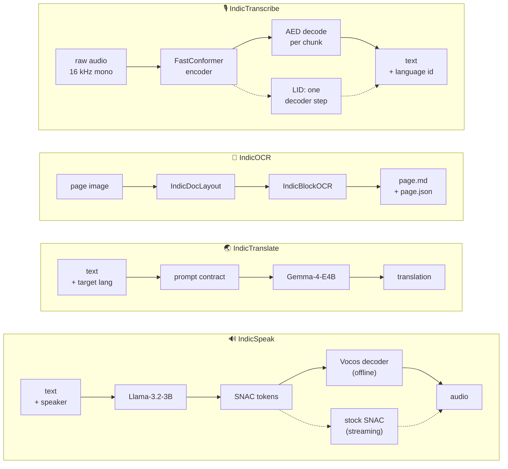

<div align="center">

# Bodhan GenAI

**Model tooling for Bodhan's generative models — one modality per subpackage.**

Data pipelines · training · inference · serving

[](https://github.com/Bodhan-AI/bodhan_genai/actions/workflows/ci.yml)
[](https://www.python.org/downloads/)
[](LICENSE)
[](CHANGELOG.md)

</div>

---

## The four stacks

Each is self-contained, with its own pipeline from raw data to a running server. **The package
README is the canonical doc for each model** — what it is, its numbers, its API.

| | model | backbone | in → out | docs |
|---|---|---|---|---|
| 🔊 | **IndicSpeak** &nbsp;`bodhan_genai.tts` | Llama-3.2-3B → [SNAC 24 kHz](https://github.com/hubertsiuzdak/snac) tokens → fine-tuned [Vocos](https://github.com/gemelo-ai/vocos) decoder | text → speech | [README](src/bodhan_genai/tts/README.md) |
| 🌏 | **IndicTranslate** &nbsp;`bodhan_genai.mt` | Gemma-4-E4B | English ⇄ 22 Indian languages, 44 directions | [README](src/bodhan_genai/mt/README.md) |
| 📄 | **IndicOCR** &nbsp;`bodhan_genai.ocr` | PP-DocLayoutV3 + Qwen3.5-0.8B | page image → Markdown + per-block JSON | [README](src/bodhan_genai/ocr/README.md) |
| 🎙️ | **IndicTranscribe** &nbsp;`bodhan_genai.asr` | Canary-2 AED (FastConformer + Transformer) | speech → text, 3 script modes + language id | [README](src/bodhan_genai/asr/README.md) |



Each stack also carries a full data → training → serving pipeline; those are drawn per stack in
the package READMEs and the `end-to-end` pages.

One default worth knowing up front: **IndicSpeak decodes offline audio with a fine-tuned Vocos
decoder**, not SNAC's own — SNAC's quantizer and encoder are untouched. Streaming still decodes
with stock SNAC, so the two paths are not bit-identical. `vocos=False` restores stock SNAC
everywhere. See [Inference](docs/tts/inference.md).

---

## Install

**One environment, every modality.**

```bash
./install.sh                    # TTS + MT + OCR + ASR → ./.venv
source .venv/bin/activate
```

Conda-free and uv-first, with the interpreter pinned by `.python-version` and every version fixed
by `constraints.txt`. The installer encodes a **required install order** — vLLM first from its
per-CUDA index so it pulls its own matched torch, then torchaudio/torchvision, then the package —
and deviating from it is the number-one cause of broken environments.

| flag | use |
|---|---|
| `--extras all-tts` / `all-mt` / `all-ocr` / `all-asr` | lean single-modality install |
| `--no-venv` | install into the already-active environment |
| `--cpu` | laptop / CI dev install, no GPU wheels |
| `--offline WHEEL_DIR` | air-gapped nodes |
| `--no-flash-attn` | skip the flash-attn source build (IndicSpeak *training* only) |
| `CUDA_TAG=cu126` | match a different driver CUDA line (default `cu129`) |

<details>
<summary>Manual pip, and air-gapped nodes</summary>

The order below is the one `install.sh` encodes. **vLLM first** — it pulls its own matched torch,
and pre-pinning torch half-installs it.

```bash
# 1. vLLM FIRST, from its per-CUDA wheel index, letting it pull its own torch
pip install vllm==0.26.0 --extra-index-url https://wheels.vllm.ai/0.26.0/cu129 \
    --extra-index-url https://download.pytorch.org/whl/cu129
# 2. torchaudio / torchvision, matched to that torch
pip install torchaudio torchvision --index-url https://download.pytorch.org/whl/cu129
# 3. the package, under constraints
pip install -e . -c constraints.txt
# 4. flash-attn last and unpinned — a source build, IndicSpeak *training* only
pip install flash-attn --no-build-isolation
```

Air-gapped:

```bash
./install.sh --offline /path/to/WHEEL_DIR
export HF_HUB_OFFLINE=1
```

Use local filesystem paths for every model/tokenizer reference in configs — the shipped configs
carry cluster-local paths as comments next to each Hub id.

</details>

Broken environment? → **[docs/troubleshooting.md](docs/troubleshooting.md)**

---

## 60-second start

Each package README carries the full commands, the training path and the serving setup.

```python
from bodhan_genai.tts import IndicTTSEngine

IndicTTSEngine("/path/to/checkpoint").synthesize("Hello world", speaker="S1").save("hi.wav")
```

```python
from bodhan_genai.mt import IndicMTEngine

with IndicMTEngine() as e:
    print(e.translate("Hello world", tgt_lang="hin_Deva").text)
```

```python
from bodhan_genai.ocr import IndicOCR

with IndicOCR() as parser:
    print(parser.parse("page.png").markdown)
```

```python
from bodhan_genai.asr import IndicASREngine

with IndicASREngine("/path/to/checkpoint") as e:
    print(e.transcribe_batch(["clip.wav"], lang="hi"))
```

> **Note** — the default checkpoints resolve from the public `bodhan-ai/` Hub repos, so these
> run without credentials. Pass a local path to work offline. If you ever do see a 401/403,
> export an `HF_TOKEN` — and note the Hub answers 404 rather than 403 for a repo a token cannot
> read, so "not found" usually means access, not a wrong id.

---

## Documentation

A rendered site — including a generated API reference — is built from `docs/` by
[MkDocs](mkdocs.yml): `pip install -e '.[docs]' && mkdocs serve`.

| you want to… | go to |
|---|---|
| understand or run a stack | [IndicSpeak](src/bodhan_genai/tts/README.md) · [IndicTranslate](src/bodhan_genai/mt/README.md) · [IndicOCR](src/bodhan_genai/ocr/README.md) · [IndicTranscribe](src/bodhan_genai/asr/README.md) |
| walk one end to end, in order | [TTS](docs/tts/end-to-end.md) · [MT](docs/mt/end-to-end.md) · [OCR](docs/ocr/end-to-end.md) · [ASR](docs/asr/end-to-end.md) |
| fix a broken environment | [docs/troubleshooting.md](docs/troubleshooting.md) |
| get a prompt or contract exactly right | [MT prompt contract](docs/mt/prompt_contract.md) · [OCR block taxonomy](docs/ocr/contract.md) |
| learn the frozen SNAC token layout | [docs/tts/token_layout.md](docs/tts/token_layout.md) |
| trust an ASR WER or LID number | [docs/asr/caveats.md](docs/asr/caveats.md) |
| look up a config field | [TTS](docs/tts/configs.md) · [MT](docs/mt/configs.md) · [OCR](docs/ocr/configs.md) · [ASR](docs/asr/configs.md) |
| run a notebook walkthrough | [notebooks/](notebooks/README.md) |
| copy a short runnable snippet | [examples/](examples/README.md) |
| qualify a TTS release | [docs/tts/release.md](docs/tts/release.md) |
| contribute, or find your way around the tree | [CONTRIBUTING.md](CONTRIBUTING.md) |

---

## License

Apache License 2.0 — see [LICENSE](LICENSE) and [NOTICE](NOTICE).

## Acknowledgements

- [Orpheus TTS](https://github.com/canopyai/Orpheus-TTS) by Canopy Labs — model recipe and token
  layout the IndicSpeak pipeline follows.
- [SNAC](https://github.com/hubertsiuzdak/snac) by hubertsiuzdak — the 24 kHz neural audio codec.
- [Vocos](https://github.com/gemelo-ai/vocos) by Gemelo AI — the decoder architecture IndicSpeak
  finetunes against `snac_24khz` for offline decode.
- [Llama](https://www.llama.com/) by Meta — the Llama-3.2-3B IndicSpeak backbone.
- [Gemma](https://ai.google.dev/gemma) by Google — the Gemma-4-E4B backbone IndicTranslate is built on.
- [NVIDIA NeMo](https://github.com/NVIDIA/NeMo) — the Canary-2 AED architecture IndicTranscribe ports.
- [BPCC / IN22](https://ai4bharat.iitm.ac.in/) by AI4Bharat — Indic parallel corpora and the
  benchmark IndicTranslate is evaluated on.
- [PP-DocLayoutV3](https://github.com/PaddlePaddle/PaddleOCR) by PaddlePaddle — the layout
  detection architecture IndicDocLayout finetunes.
- [Qwen](https://github.com/QwenLM) by Alibaba — the backbone of the IndicBlockOCR recognizer.
- [vLLM](https://github.com/vllm-project/vllm), [TRL](https://github.com/huggingface/trl) and
  [PEFT](https://github.com/huggingface/peft) — inference and finetuning machinery these
  pipelines build on.
