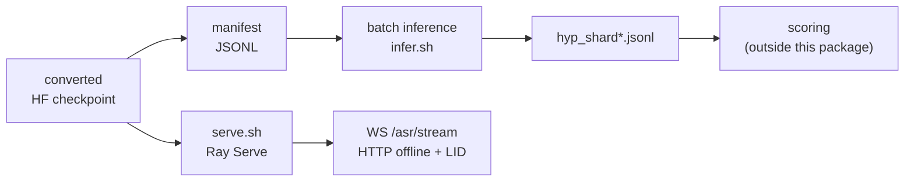

# IndicTranscribe end to end

One ordered pass from a converted checkpoint to scored output. Every command here is runnable as
written; the deep dives are linked at each step.



Unlike the other three stacks, **there is no training step here**. IndicTranscribe is a port: the
checkpoint is converted from NeMo, not trained in this repo. See
[Model and port](model.md) for what conversion does and where it deviates.

---

## 1. Install

```bash
./install.sh --extras all-asr     # or plain ./install.sh for every modality
source .venv/bin/activate
```

Serving needs one extra: `pip install -e ".[asr-serve]"`.

## 2. Point at a checkpoint

Nothing to do if you want the published checkpoint: everything below resolves
`bodhan-ai/indic-transcribe-core` by default, which is public — no credentials needed.

To use your own instead — a local directory or another repo id:

```bash
export MODEL_DIR=/path/to/indic-transcribe-hf     # or BODHAN_ASR_HF_REPO=org/repo
```

All three loaders — model, tokenizer and feature extractor — accept either form. The model class
gets that from transformers; the other two go through `bodhan_genai.asr.checkpoints.resolve_file`,
which delegates to the same `transformers.utils.cached_file` resolver, so `revision`, `subfolder`,
`token` and `HF_HUB_OFFLINE` behave as they do anywhere else in the transformers API.

## 3. Write a manifest

JSONL, one object per line, with an audio path and a language:

```json
{"audio_path": "/audio/0001.wav", "language": "hi"}
```

Use `--audio-key` / `--lang-key` for different field names, or `--lang hi` to force one language
for the whole run. Input fields are copied through to the output alongside `row` and
`hypothesis`, so ids and metadata survive.

!!! danger "The language label is not validated, and a wrong one fails silently"

    Transcription is language-conditioned and has no LID of its own. A wrong `lang` yields
    confidently wrong *script* rather than garbage — output that looks fine until someone reads
    it. If you do not know the language per row, run [LID](#5-language-identification) first.

## 4. Batch inference

```bash
python -m bodhan_genai.asr.inference.transcribe \
    --manifest data.jsonl --model-dir "$MODEL_DIR" --out-dir out/
```

Eight GPUs, one shard each:

```bash
MODEL_DIR="$MODEL_DIR" NUM_SHARDS=8 \
    scripts/asr/infer.sh --manifest data.jsonl --out-dir out/
```

Pick the output mode for the whole run with `--itn` (mixed script) or `--romanized`; the default
is native script. Add `--chunk-above 45` to segment long rows on silences — audio at or below the
threshold is decoded whole, because chunking shorter audio measurably hurts.

**Budget 4–8 CPU cores per GPU.** Audio decode and feature assembly are CPU work; with 2 CPUs for
8 GPUs, per-shard encode time went from 18 s to 437 s.

Each shard appends to `out/hyp_shard<N>.jsonl` and skips rows already present, so a killed run
resumes by re-running the same command. Resume is keyed on the **manifest row index**, never on
an id field — see [Usage § Resume](usage.md#resume) for why.

## 5. Language identification

One decoder step over encoder states the transcription already computed, not a second pass.

```python
from bodhan_genai.asr import IndicASREngine

with IndicASREngine("/path/to/indic-transcribe-hf") as e:
    top = e.detect_language(["unknown.wav"])  # [[('hi', 0.99), ('ur', 0.004), ...]]
    lang = top[0][0][0]
    text = e.transcribe_batch(["unknown.wav"], lang=lang)
```

Already holding encoder states inside your own batching loop? Use
`bodhan_genai.asr.engine.lid.lid_from_encoder_states` and skip the second encoder pass.

!!! danger "The 96.9% figure is agreement with NeMo, not accuracy"

    Measured top-1 is **0.864** (lattice) and **0.779** (VOI) over 337k clips — the two
    implementations agree closely and are wrong together on the confusable pairs.

    The average hides a very uneven spread. `ml`/`ta` reach 0.979, but `bho` is **0.047**,
    `hi` **0.258**, `mai` 0.356 and `ur` 0.490, because a close neighbour absorbs them.
    **Do not use LID for hi/bho/mai/ur if you have any metadata at all.** Filtering on the
    returned probability does not rescue it: accuracy on surviving rows rises (0.779 → 0.836
    at p≥0.7) but coverage falls faster. Full analysis: [caveats.md](caveats.md).

## 6. Serving

```bash
pip install -e ".[asr-serve]"
MODEL_DIR="$MODEL_DIR" ./scripts/asr/serve.sh
```

One Ray Serve replica per GPU, each holding one engine. `NUM_REPLICAS` and `PORT` override the
defaults (GPU count, 8000). Buffered streaming over websocket, plus HTTP endpoints for offline
transcription and language ID.

**Streaming is buffered, not frame-synchronous** — the latency floor is one decode interval, and
`--stream_max_segment_s` (default 5 s) is the hard ceiling on time-to-first-text. Do not raise
`--max_ongoing_requests` past 32 to buy capacity; see [Configs](configs.md) for what happens.

Protocol and endpointing: [Serving](serving.md).

## 7. Scoring

Deliberately **not** in this package. It writes hypotheses and stops, matching the repo-wide
convention that model-quality metrics live outside the inference library.

!!! danger "Read the scoring pitfalls first"

    The normalisation choices in [caveats.md §3](caveats.md) move WER by **more than 15 points** —
    far more than any model difference you are likely to be measuring. A WER quoted without
    stating them means nothing.
