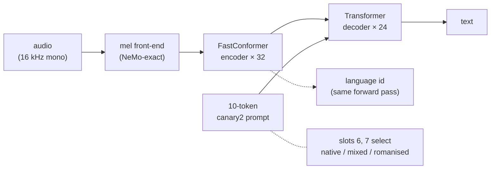
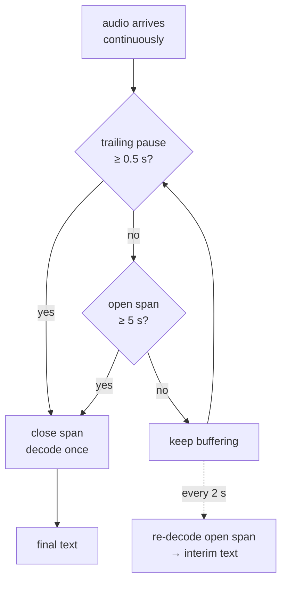

# IndicTranscribe

Speech recognition for English and 22 Indic languages — a NeMo-independent, HuggingFace-style
port of the **Canary-2 AED** architecture: a 32-layer FastConformer encoder and a 24-layer
Transformer decoder, about 1.2B parameters.



Three things shape the whole API and are easy to miss:

- **One checkpoint, three output modes.** Slots 6 and 7 of the frozen 10-token prompt select
  native script, mixed script (ITN) or romanised. Prompts are exactly 10 tokens in every mode,
  which is what keeps mixed-mode batches working.
- **It is language-conditioned, and the transcription path has no LID of its own.** You supply
  `lang`. A wrong label yields *confidently wrong script*, not visible errors.
- **Streaming is buffered, not frame-synchronous.** That follows from the architecture, not from
  this implementation — an attention encoder-decoder attends over a whole span before emitting.

## Why streaming has a latency floor

A CTC or RNN-T model emits as frames arrive. An AED cannot: it decodes a span once the span is
closed. So time-to-first-text is bounded by whichever comes first — a trailing pause long enough
to close the span, or the force-cut bound.



`stream_max_segment_s` is therefore the latency SLO knob, not a throughput knob: a pause-free
stretch of speech yields nothing until it elapses. Interim text is not free — each partial is a
full re-decode of the open span.

## Quick example

```python
from bodhan_genai.asr import IndicASREngine

with IndicASREngine("/path/to/indic-transcribe-hf") as e:
    print(e.transcribe_batch(["clip.wav"], lang="hi"))
```

## In this section

| page | what it covers |
|---|---|
| [End to end](end-to-end.md) | One ordered pass: checkpoint → batch inference → serving → scoring |
| [Usage](usage.md) | The Python API, the batch CLI, sharding, resume and backends |
| [Model and port](model.md) | Architecture, parity with NeMo, the decoding contract, documented deviations |
| [Serving](serving.md) | Ray Serve topology, the streaming protocol, endpointing |
| [Configs](configs.md) | Every server and CLI knob, with the measurement behind each default |
| [Caveats](caveats.md) | What a WER or LID number here does and does not mean — **read before quoting one** |
| [API reference](../reference/asr.md) | Generated from the source |
