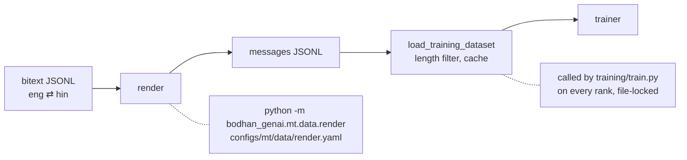

# MT data pipeline



There is **no offline packing stage**. TRL tokenizes from a `messages` dataset with `packing=False`,
one example per sequence, so the assistant-only loss mask lines up with exactly one translation.

## Stage 1 — render

```bash
scripts/mt/render.sh                                          # configs/mt/data/render.yaml
scripts/mt/render.sh configs/mt/data/render.yaml --dry-run     # counts and mix, writes nothing
```

### Input

One JSON object per line, with a source and a target field. Field *names* are yours; the config
says which is which:

```json
{"eng": "The committee approved the proposal.", "hin": "समिति ने प्रस्ताव को मंजूरी दे दी।"}
{"eng": "The meeting has been postponed.",      "hin": "बैठक स्थगित कर दी गई है।"}
```

### Output

```json
{"messages": [{"role": "user",      "content": "Translate the following text into Hindi:\n\nThe committee approved the proposal."},
              {"role": "assistant", "content": "समिति ने प्रस्ताव को मंजूरी दे दी।"}],
 "corpus": "bpcc-hin", "direction": "eng_Latn-hin_Deva",
 "src_lang": "eng_Latn", "tgt_lang": "hin_Deva",
 "src_name": "English", "tgt_name": "Hindi",
 "template_variant": "target_only", "template_id": 6}
```

Only `messages` is used for training. Everything else is provenance — and it is what makes a
per-language or per-direction slice of the corpus possible afterwards, which you will want the
first time one direction looks wrong.

### Config

```yaml
seed: 42
template_variant: "target_only"   # the released contract; see prompt_contract.md
dedup: true
extra_languages: {}               # out-of-set languages, keyed by FLORES-style code

output:
  train: "data/mt/rendered/train.jsonl"
  dev: "data/mt/rendered/dev.jsonl"
  dev_fraction: 0.01
  dev_max_rows: 2000

sources:
  - name: "bpcc-hin"
    path: "data/mt/bitext/bpcc_eng_hin.jsonl"
    src_field: "eng"
    tgt_field: "hin"
    src_lang: "eng_Latn"
    tgt_lang: "hin_Deva"
    reverse_fraction: 1.0
    limit: null
```

| field | notes |
|---|---|
| `seed` | everything derived from it is stable across runs and machines — the render is byte-reproducible |
| `template_variant` | `target_only` \| `with_source`. Leave it alone unless you have a single fixed direction |
| `dedup` | drops exact duplicate `(direction, source, target)` triples, **across all sources** |
| `extra_languages` | add a language outside the served 25 without editing the frozen contract |
| `dev_fraction` / `dev_max_rows` | eval runs every few hundred steps; a dev set of 1 % of 3 M rows would dominate wall-clock for no extra signal |
| `reverse_fraction` | bitext is normally stored one-way; `1.0` makes the corpus bidirectional, `0.2` is sensible for a token-heavy document corpus |
| `limit` | cap input rows for a smoke run |

Multiple `sources` entries are concatenated, with dedup applied globally.

### Things that will bite you

**Upsample *before* rendering, not after.** The template RNG advances per row, so N copies of a row
arriving at the renderer get N different phrasings — useful augmentation. Copies made after
rendering all share one phrasing, which is memorisation bait.

**Dedup keys on the raw pair, not the rendered instruction.** Each copy of a repeated row draws its
own phrasing, so rendered instructions differ and would never compare equal — keying on them means
dedup silently does nothing — it drops nothing at all, while appearing to work.

**Direction is part of the dedup key.** `en→hi` and `hi→en` of the same pair are two legitimate
training rows, not duplicates.

**Rows with an empty side are dropped and counted.** The run logs a per-source breakdown:

```
probe:read                52
probe:empty                1
probe:eng_Latn-hin_Deva   51
probe:hin_Deva-eng_Latn   51
dropped:duplicate          2
```

Read that table. A `*:empty` count near your row count means the field names in the config are
wrong, and you would otherwise get a tiny corpus and a suspiciously fast epoch.

## Stage 2 — dataset load and cache

Called by the trainer, not run directly:

```python
load_training_dataset(tokenizer, filename, cache_dir, split, max_seq_length, num_proc)
```

1. `load_dataset("json", …)`
2. measure each row's **fully rendered chat length** with the real tokenizer
3. filter to `<= max_seq_length`
4. drop everything but `messages`
5. shuffle (`seed=42`)
6. `save_to_disk(<cache_dir>/processed_dataset/<split>)`

Re-running returns the cache directly. Delete that directory to force a rebuild.

### Why a file lock and not a barrier

Under `accelerate launch` every rank runs this. Coordinating with `dist.barrier()` means
initialising the process group early and risking an NCCL timeout while one rank tokenizes a
multi-million-row corpus. A `filelock.FileLock` has neither problem: the first rank in builds, the
rest block and then load from disk in seconds. One lock per split, so train and dev do not
serialise on each other.

### Why the filter measures the rendered chat

Filtering on `len(text)` lets rows through that exceed `max_seq_length` once the template and
special tokens are added. TRL then truncates them, which teaches the model to emit unterminated
translations — a failure that shows up as degenerate output at inference, not as anything in the
loss.

Related trap, if you write your own measurement: `apply_chat_template(..., tokenize=True)` returns
a `BatchEncoding`, and `len()` on that is the number of keys (2), not the token count. Index
`["input_ids"]`.

If *every* row is filtered out the loader raises rather than training on nothing.

## Reproducibility

Same config + same input ⇒ byte-identical `train.jsonl` and `dev.jsonl`. Seeds are derived with a
stable hash (`blake2b`), not Python's `hash()`, which is salted per process for strings.

Held-out selection is seeded independently of the template draw, so changing the phrasing bank does
not reshuffle which rows are in dev.

## Sizing

Typical shapes, for calibration:

| corpus | avg tokens/row | p90 | max |
|---|---|---|---|
| sentence bitext | ~90 | ~130 | ~460 |
| mixed sentence + document | ~1000 | ~2600 | ~32700 |

Sentence-level corpora sit far below `max_seq_length: 8192`, so the filter drops nothing and most
of each sequence is padding — if that is all you have, dropping `max_seq_length` to 2048 is a large
free memory win. Document corpora are strongly bimodal, and that is what the 8k default is for.

Note also that 85 % of rows being sentence bitext can still be under 6 % of the *tokens*. If you
are balancing a mix, weigh by tokens, not rows.
