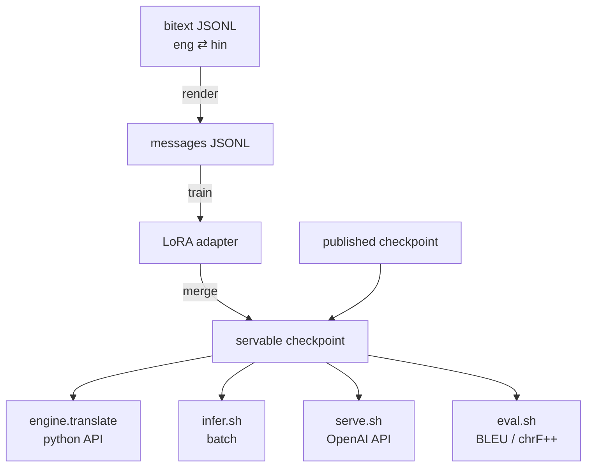

# MT end to end

One page covering every MT workflow: translate, finetune, merge, serve, evaluate. Some of it repeats
the focused docs ([prompt_contract](prompt_contract.md), [data_pipeline](data_pipeline.md),
[training](training.md), [serving](serving.md), [eval](eval.md), [configs](configs.md)) — read this
first, then those for detail.



---

## 0. Set up

One environment covers every modality. MT needs `transformers>=5.12` and `vllm>=0.20` for the
Gemma 4 architecture, and the whole repo now sits on those versions:

```bash
./install.sh
source .venv/bin/activate
```

The installer pins `torch` from the CUDA-specific index, then `vllm` from its per-CUDA index, then
the package under `constraints.txt`. It ends by asserting two things that otherwise fail
confusingly much later:

- `transformers` really registers `Gemma4ForConditionalGeneration`;
- `torch.cuda.is_available()` — a vLLM wheel built for a newer CUDA than the driver imports cleanly
  and then silently reports **no GPU**.

If the second check fails on a machine that has GPUs, rebuild with a CUDA line matching your driver:

```bash
CUDA_TAG=cu126 ./install.sh
```

Re-running the installer is safe; it reuses the venv.

### Two things worth setting up front

**A writable HF cache.** If `HF_HUB_CACHE` is set in your shell it wins over `HF_HOME`, so setting
only `HF_HOME` can send a 16 GB download somewhere you did not intend. Set both:

```bash
export HF_HOME=/path/you/own/.hf-cache
export HF_HUB_CACHE=$HF_HOME/hub
export HF_DATASETS_CACHE=$HF_HOME/datasets
```

**Credentials**, if the checkpoint or benchmark is private or gated: `hf auth login`, or export
`HF_TOKEN`. For a fully offline node, use local paths everywhere and `export HF_HUB_OFFLINE=1`.

---

## 1. Translate

### Python

```python
from bodhan_genai.mt import IndicMTEngine

with IndicMTEngine("bodhan-ai/indic-translate") as engine:
    print(engine.translate("The committee approved the proposal.", tgt_lang="hin_Deva").text)
    print(engine.translate("समिति ने प्रस्ताव को मंजूरी दे दी।", tgt_lang="English").text)
```

Note what you never pass: a **source** language. The prompt names only the target and the model
infers the source, which is why one call handles both directions.

`tgt_lang` takes a FLORES code (`hin_Deva`), a bare name (`hindi`), or a qualified name
(`Manipuri (Bengali script)`). For the three multi-script languages — Kashmiri, Manipuri, Sindhi —
**the qualifier selects the output script and is not decoration**:

```python
engine.translate("The meeting was postponed.", tgt_lang="snd_Deva")  # मीटिंग मुल्तवी कयो वियो।
engine.translate("The meeting was postponed.", tgt_lang="snd_Arab")  # اجلاس ملتوي ڪيو ويو.
```

Batch and document modes:

```python
results = engine.translate_batch(segments, tgt_lang="Tamil")  # one continuous vLLM batch
doc = engine.translate_document(article, tgt_lang="Kannada", max_new_tokens=8192)
```

Per-row failures land in `result.error` instead of raising, so one bad segment never loses a run.
Load the engine **once** per process — model load is ~16 GB and tens of seconds.

### Two backends

| backend | use it for |
|---|---|
| `"vllm"` (default) | throughput; a whole corpus in one continuous batch |
| `"hf"` | a dependency-light single run, or an **unmerged** PEFT adapter |

```python
IndicMTEngine(base, backend="hf", adapter_dir="training_output/mt-lora-8k")
```

`adapter_dir` with the vLLM backend raises — merge first (§3).

### CLI

```bash
# list the 25 supported targets
python -m bodhan_genai.mt.inference.cli hf --list-languages

# one segment
python examples/mt/basic_translate.py --tgt-lang Hindi --text "Hello world."

# a whole file, batched, to JSONL
scripts/mt/infer.sh --tgt-lang mar_Deva --input-file segments.txt --output-file out.jsonl

# a document as one request (structure preserved)
scripts/mt/infer.sh --tgt-lang Tamil --document --input-file article.txt --max-new-tokens 8192
```

Defaults come from `configs/mt/infer/offline_vllm.yaml`; any flag you pass overrides it.

**Sizing `max_new_tokens`:** 512 for sentences, ~2048 a paragraph, ~8192 a document. Indic targets
need roughly **1.5–2× the English source token count** — under-budget it and you truncate
mid-sentence.

Decoding is **greedy** by default. That is the recommendation for translation and the only setting
reproducible run to run.

---

## 2. Finetune

> The finetuning recipe is a **provisional default** — see [training.md](training.md). It works and is
> a reasonable starting point, not a configuration shown to be optimal.

### 2a. Prepare data

Start from bitext JSONL — one object per line, a source field and a target field. The field *names*
are yours:

```json
{"eng": "The committee approved the proposal.", "hin": "समिति ने प्रस्ताव को मंजूरी दे दी।"}
```

Point a render config at it (copy `configs/mt/data/render.yaml`):

```yaml
seed: 42
template_variant: "target_only"     # the served contract — leave this alone
dedup: true
output:
  train: "data/mt/rendered/train.jsonl"
  dev: "data/mt/rendered/dev.jsonl"
  dev_fraction: 0.01
  dev_max_rows: 2000
sources:
  - name: "my-corpus"
    path: "data/mt/bitext/eng_hin.jsonl"
    src_field: "eng"
    tgt_field: "hin"
    src_lang: "eng_Latn"
    tgt_lang: "hin_Deva"
    reverse_fraction: 1.0           # also emit every row reversed
```

```bash
scripts/mt/render.sh configs/mt/data/render.yaml --dry-run   # check the mix first
scripts/mt/render.sh configs/mt/data/render.yaml
```

**Read the stats table it prints.** A `*:empty` count near your row count means the field names are
wrong — you would otherwise get a tiny corpus and a suspiciously fast epoch:

```
my-corpus:read                1024
my-corpus:empty                  0
my-corpus:eng_Latn-hin_Deva   1024
my-corpus:hin_Deva-eng_Latn   1024
dropped:duplicate                0
```

A **dev split is required**: checkpoint selection is by `eval_loss` and early stopping has nothing to
watch without one.

Do any upsampling or corpus mixing *before* rendering — the template RNG advances per row, so N
copies get N different phrasings (useful); copies made afterwards all share one.

### 2b. Train

Point `configs/mt/train/lora.yaml` at your rendered files, then:

```bash
scripts/mt/train_lora.sh configs/mt/train/lora.yaml
NUM_GPUS=4 scripts/mt/train_lora.sh configs/mt/train/lora.yaml     # override GPU count
```

`model_path` defaults to the released **IndicTranslate** checkpoint, not stock Gemma — finetuning starts
from a model that already translates. Point it at `google/gemma-4-E4B-it` only to reproduce IndicTranslate
from scratch. It takes a Hub repo id or a local directory; the Hub repo is gated, so `hf auth login`
first.

Re-running with the same `training.output_dir` resumes from the last checkpoint. Set
`resume: false` to start fresh.

**Check the trainable-parameter line** the run prints on rank 0. It should be a low single-digit
percentage — that is the LoRA adapter, with the vision/audio towers excluded:

```
trainable params: 100,999,168 || all params: 8,042,100,000 || trainable%: 1.2559
```

If it shows the whole model, `peft_config` was not applied.

`max_length`, `packing` and `assistant_only_loss` are owned by the recipe; setting them in the config
logs a warning and is ignored.

### Multi-GPU and multi-node

Both use **DDP**, not FSDP — only the adapter is trainable, so sharding would add communication for
nothing. Single node needs no change beyond the process count:

```bash
NUM_GPUS=8 scripts/mt/train_lora.sh configs/mt/train/lora.yaml
```

Multi-node swaps in the `c10d` rendezvous config and passes the head node's address, one launcher per
node:

```bash
head=$(scontrol show hostnames "$SLURM_JOB_NODELIST" | head -n1)
srun --export=ALL accelerate launch \
  --config_file configs/mt/accelerate/multinode.yaml \
  --num_machines "$SLURM_NNODES" \
  --num_processes $(( SLURM_NNODES * 8 )) \
  --machine_rank "$SLURM_NODEID" \
  --main_process_ip "$head" --main_process_port 29500 \
  -m bodhan_genai.mt.training.train configs/mt/train/lora.yaml
```

Under Slurm, set `HF_HOME`/`HF_HUB_CACHE` inside the job and put `data.cache_dir` on a filesystem
every node can see. The tokenized-dataset cache is built by whichever rank gets there first and
guarded by a file lock, so no barrier is needed and there is no NCCL-timeout risk on a large corpus.

Effective batch is `per_device_train_batch_size × gradient_accumulation_steps × world_size` — adding
GPUs increases it, so it is not a free speedup at a fixed learning rate.

### Continuing from an existing adapter

Two different operations; the config refuses to let them be confused:

```yaml
model:
  adapter_path: training_output/previous/checkpoint-4400   # seed weights only
resume: false                                             # fresh optimizer/scheduler/LR
```

versus `resume: true` with no `adapter_path`, which continues an interrupted run. Setting both raises.

---

## 3. Merge a finetune into a servable checkpoint

A LoRA adapter is a few hundred MB and needs its base at load time; vLLM wants one self-contained
directory.

```bash
scripts/mt/merge.sh training_output/mt-lora-8k/checkpoint-4400 merged-ckpt-4400
```

That does four things, and **all four are required** for the result to load:

1. folds `W + (alpha/r)·B@A` into the base weights;
2. re-enables `use_cache` (training turns it off; without this every generated token re-runs the full
   forward pass);
3. stages the tokenizer **and** `processor_config.json` from the base model — a merged text-only save
   writes no processor config, but vLLM loads the Gemma 4 processor;
4. adds the KV-shared `k_norm` sidecar.

On (4): Gemma 4 E4B shares K/V across its last 18 decoder layers and so stores no `k_norm` for them,
while vLLM builds the module for every layer and its loader aborts:

```
ValueError: Following weights were not initialized from checkpoint:
{'model.language_model.layers.<24..41>.self_attn.k_norm.weight', ...}
```

`scripts/mt/merge.sh` runs the fix for you. To apply it to a checkpoint you already have:

```bash
python -m bodhan_genai.mt.tools.vllm_ready <checkpoint> --dry-run   # look first
python -m bodhan_genai.mt.tools.vllm_ready <checkpoint>
```

It writes a ~13 KB sidecar of zeroed tensors and (re)generates the weight index, leaving the weights
and `config.json` untouched. Zeros are correct twice over: the values are never read on a shared
layer, and Gemma's RMSNorm computes `x * (1 + weight)`, so zero is the identity. It is idempotent, and
it handles a single-shard checkpoint with no index — the normal output of a merge.

> If you previously *patched vLLM* to work around that load error, undo it. A patched vLLM now fails
> on a converted checkpoint. `pip install --force-reinstall "vllm>=0.20"`.

---

## 4. Serve

Stock `vllm serve` — there is no custom server in this repo. `scripts/mt/serve.sh` is a wrapper that
picks a free port, waits for readiness, and records what it bound:

```bash
scripts/mt/serve.sh                                   # published checkpoint, GPU 0, port 8000
CHECKPOINT=merged-ckpt-4400 scripts/mt/serve.sh       # your finetune
GPU=3 PORT=8100 MAX_MODEL_LEN=32768 scripts/mt/serve.sh
```

It writes `vllm-serve.info` with the port actually bound, because a busy port makes it move. Sanity
signs in the log:

```
Resolved architecture: Gemma4ForConditionalGeneration
Gemma4 model has heterogeneous head dimensions (head_dim=256, global_head_dim=512).
  Forcing TRITON_ATTN backend to prevent mixed-backend numerical divergence.
```

Both are expected. The readiness check requires *your* `--served-model-name`, so a stranger's server
on the same port cannot look like success.

Talk to it with the typed client, which owns the prompt contract:

```python
from bodhan_genai.mt.serving import MTClient

client = MTClient("http://localhost:8000/v1")
client.translate("Hello world", tgt_lang="hin_Deva")
results = client.translate_batch(segments, tgt_lang="Tamil", num_workers=32)
```

`translate_batch` preserves input order regardless of completion order. Or by CLI / raw HTTP:

```bash
python -m bodhan_genai.mt.serving.client --tgt-lang Hindi --text "Hello world"

curl http://localhost:8000/v1/chat/completions \
  -H 'Content-Type: application/json' \
  -d '{"model": "indic_translate",
       "messages": [{"role": "user",
         "content": "Translate the following text into Marathi:\n\nThe meeting was postponed."}],
       "temperature": 0, "max_tokens": 512, "stop": ["<turn|>"]}'
```

Hardware: 24 GB suffices for sentences and paragraphs; 40 GB+ for 32k-token documents. Multi-GPU via
`TENSOR_PARALLEL_SIZE`.

---

## 5. Evaluate

`eval_loss` is a proxy. Translation quality is chrF++ and BLEU on a held-out benchmark. With a server
running:

```bash
scripts/mt/eval.sh --langs hin_Deva --directions en-xx --max-samples 32   # smoke
scripts/mt/eval.sh                                                       # full run
```

Writes `metrics.json` plus the per-direction predictions and references. **Keep the prediction
files** — they are what makes a bad number diagnosable.

Reading the numbers:

- `*_pooled` is the headline (all directions as one corpus); `*_macro` is the unweighted mean. They
  differ by around a point, so quote which one you mean and compare like with like.
- The **noise floor is about ±0.06 chrF++** — vLLM's continuous batching reorders float reductions
  even at temperature 0. Batch size can also flip a near-tie token. Read nothing into a difference
  under ~0.1, and treat ±0.2 as a tie when choosing between checkpoints.
- A large BLEU drop with a small chrF++ drop is usually a few degenerate generations, not a
  systematic regression — `bodhan_genai.mt.eval.metrics.is_degenerate` flags empty and runaway
  output. If chrF++ moved too, suspect the prompt first, then the checkpoint, then versions.
- Absolute scores vary enormously by language. Compare a direction against *itself* over time, never
  against another direction.

The benchmark is gated on the Hub — authenticate first.

---

## 6. The complete loop

```bash
# once
./install.sh && source .venv/bin/activate

# data -> adapter
scripts/mt/render.sh     configs/mt/data/render.yaml
scripts/mt/train_lora.sh configs/mt/train/lora.yaml

# adapter -> servable checkpoint
scripts/mt/merge.sh training_output/mt-lora-8k/checkpoint-4400 merged-ckpt-4400

# serve it, then score it
CHECKPOINT=merged-ckpt-4400 scripts/mt/serve.sh
scripts/mt/eval.sh
```

---

## If something looks wrong

The failure mode to internalise: **a broken prompt does not raise.** The model returns fluent,
plausible text that is simply worse, and nothing in a log or a loss curve says so. So when quality
looks off, check the prompt before the model.

| symptom | cause |
|---|---|
| `transformers X < 5.12` / unknown architecture `gemma4` | wrong venv — `source .venv/bin/activate` |
| `torch.cuda.is_available()` False on a GPU box | vLLM wheel built for newer CUDA than the driver; reinstall with `CUDA_TAG=` |
| `weights were not initialized … k_norm` | run `bodhan_genai.mt.tools.vllm_ready` on the checkpoint |
| merged checkpoint rejected by vLLM | missing `processor_config.json` — use `scripts/mt/merge.sh` |
| fluent but poor translations | the prompt: a source language named, a system turn added, or a bare multi-script language name |
| output truncated mid-sentence | `max_new_tokens` too low; Indic targets need 1.5–2× the source |
| every training row filtered out | the length filter measures the *rendered chat*, not raw text |
| OOM at 8192 tokens | raise `gradient_accumulation_steps`, confirm `gradient_checkpointing`, or lower `max_seq_length` |
| trainable params look like the whole model | `peft_config` not applied |
| scores off by about a point | comparing a macro average against a pooled corpus score |

Deeper detail: [prompt_contract](prompt_contract.md) · [data_pipeline](data_pipeline.md) ·
[training](training.md) · [serving](serving.md) · [eval](eval.md) · [configs](configs.md)
