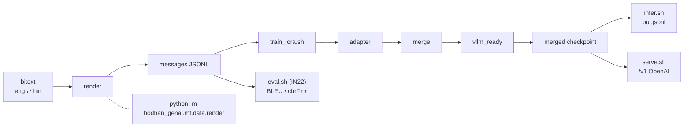

# MT

**IndicTranslate** — translation between English and 22 Eighth-Schedule Indian languages (25
language-script combinations, 44 directions). A decoder-only multimodal LLM
(`Gemma4ForConditionalGeneration`, base `google/gemma-4-E4B-it`, 7.94 B params bf16),
instruction-tuned for translation.

There are **no language tokens and no `forced_bos_token_id`**: the target language is an English
name interpolated into an instruction, and the source language is never named — the model infers
it. That is the whole API, and getting it wrong is the one failure mode that does not announce
itself.



## Quick example

```python
from bodhan_genai.mt import IndicMTEngine

with IndicMTEngine("bodhan-ai/indic-translate") as engine:
    print(engine.translate("The committee approved the proposal.", tgt_lang="hin_Deva").text)
```

Note what is never passed: a source language. The same call handles both directions.

!!! warning "The multi-script qualifier is functional, not decoration"

    For Kashmiri, Manipuri and Sindhi the parenthetical selects the output script. Prompting bare
    `"Sindhi"` instead of `"Sindhi (Devanagari script)"` measured **29.9 chrF++ worse** — and the
    output stays fluent either way.

## In this section

- [End to end](end-to-end.md) — **start here**: every workflow on one page
- [Prompt contract](prompt_contract.md) — the request format, and what breaks it
- [Data pipeline](data_pipeline.md) — bitext to instruction chat rows
- [Training](training.md) — LoRA finetuning (provisional recipe)
- [Serving](serving.md) — stock `vllm serve` plus the typed client
- [Eval](eval.md) — IN22 replication, BLEU and chrF++
- [Configs](configs.md) — field-by-field config reference
- [API reference](../reference/mt.md) — classes and functions

Full package documentation, including quickstart and troubleshooting, lives in
[`src/bodhan_genai/mt/README.md`](https://github.com/AshwinSankar17/bodhan_gen_ai_tools/blob/master/src/bodhan_genai/mt/README.md).
