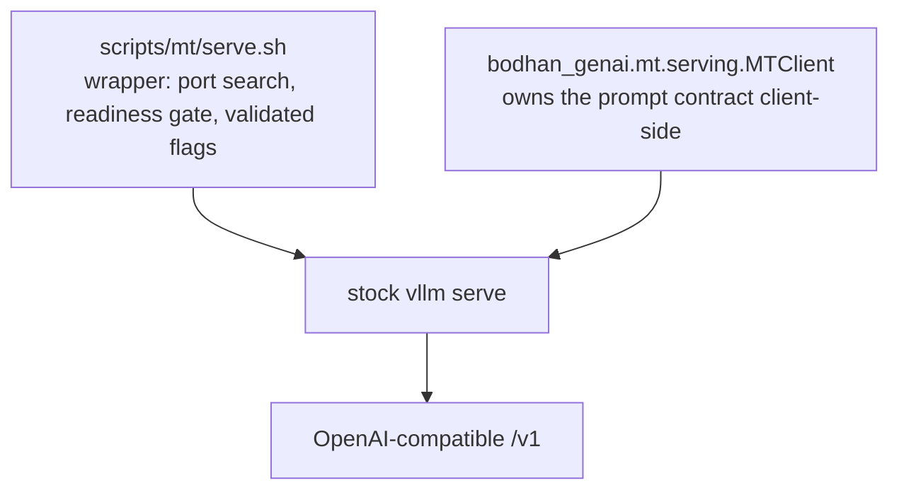

# Serving IndicTranslate

## Architecture: there is no custom server



IndicTranslate runs on unmodified vLLM ≥ 0.20 — that is the release which registers
`Gemma4ForConditionalGeneration`. Nothing in this repo sits in the request path at serve time.
That is deliberate: partners get a standard API, and there is no bespoke service to keep alive.

What *is* worth owning in-process is the [prompt contract](prompt_contract.md), and that is all
`MTClient` is.

## Files

| module | role |
|---|---|
| `scripts/mt/serve.sh` | launches `vllm serve` with the validated flags; free-port search; readiness gate; writes `vllm-serve.info` |
| `bodhan_genai.mt.serving.client` | `MTClient` — typed client that builds correct requests; also a CLI |
| `bodhan_genai.mt.tools.vllm_ready` | adds the KV-shared `k_norm` sidecar a self-trained checkpoint needs |
| `bodhan_genai.mt.training.merge` | adapter → standalone servable checkpoint |

## Run

```bash
scripts/mt/serve.sh                                   # published checkpoint, GPU 0, port 8000
CHECKPOINT=/path/to/merged-ckpt scripts/mt/serve.sh   # your own finetune
GPU=3 PORT=8100 scripts/mt/serve.sh
MAX_MODEL_LEN=32768 scripts/mt/serve.sh               # document workloads
scripts/mt/serve.sh --foreground                      # don't background
```

Extra flags pass through to `vllm serve`.

### Knobs (env)

| var | default | notes |
|---|---|---|
| `CHECKPOINT` | `bodhan-ai/indic-translate` | local path or hub id |
| `SERVED_NAME` | `indic_translate` | the name clients must ask for |
| `GPU` | `0` | sets `CUDA_VISIBLE_DEVICES` |
| `PORT` | `8000` | auto-searches +200 if taken |
| `MAX_MODEL_LEN` | `8192` | KV-cache window; 32768 is the validated ceiling |
| `GPU_MEMORY_UTILIZATION` | `0.90` | |
| `TENSOR_PARALLEL_SIZE` | `1` | |
| `VLLM_BIN` | from `$PATH` | point at another env's vllm |
| `LOG_FILE` / `INFO_FILE` | `vllm-serve.{log,info}` | |

### Why each flag is there

Not cosmetic — each one is a thing that went wrong once:

- **`--enforce-eager`** — skips CUDA-graph capture. This is the configuration the published scores
  were measured with, and capture buys little at translation output lengths.
- **`--dtype bfloat16`** — the checkpoint's native precision, unquantised.
- **`--trust-remote-code`** — required for the Gemma 4 processor. There is no remote Python in the
  checkpoint; this executes nothing of the model's own.
- **`VLLM_USE_DEEP_GEMM=0`** — matches the validated serving config.
- **Free-port search** — shared clusters squat ports; binding blindly fails with `EADDRINUSE`
  after the model has already loaded.
- **Readiness gate requires `SERVED_NAME`** — on a shared box the port may belong to someone
  else's server, so a bare HTTP 200 is a false positive. `vllm-serve.info` records the port
  actually bound, because it may not be the one you asked for.

## Talk to it

```python
from bodhan_genai.mt.serving import MTClient

client = MTClient("http://localhost:8000/v1")
print(client.translate("Hello world", tgt_lang="hin_Deva").text)

results = client.translate_batch(segments, tgt_lang="Tamil", num_workers=32)
```

`translate_batch` preserves input order regardless of completion order, so a failed row never
shifts the ones after it. Transport errors land in `MTResult.error` instead of raising.

`client.health()` returns True only when the endpoint is serving *your* model name.

As a CLI:

```bash
python -m bodhan_genai.mt.serving.client --tgt-lang Hindi --text "Hello world"
python -m bodhan_genai.mt.serving.client --tgt-lang Tamil \
    --input-file segments.txt --output-file out.jsonl --num-workers 32
```

## Raw HTTP

You can curl it — just build the request the contract's way:

```bash
curl http://localhost:8000/v1/chat/completions \
  -H 'Content-Type: application/json' \
  -d '{"model": "indic_translate",
       "messages": [{"role": "user",
         "content": "Translate the following text into Marathi:\n\nThe meeting has been postponed."}],
       "temperature": 0, "max_tokens": 512, "stop": ["<turn|>"]}'
```

Target language named, source language absent, one user turn, no system turn. Greedy
(`temperature: 0`) is the recommendation and the only reproducible setting.

## Decoding by workload

| workload | temperature | `max_tokens` | `MAX_MODEL_LEN` |
|---|---|---|---|
| sentence / short segment | 0.0 | 512 | 8192 |
| paragraph | 0.0 | 2048 | 16384 |
| full document | 0.0–0.2 | 8192 | 32768 |

Indic targets need roughly **1.5–2× the English source token count** — budget `max_tokens`
accordingly or you will truncate mid-sentence.

## Serving a checkpoint you trained

A freshly merged adapter does **not** load on stock vLLM. Two things are missing, and
`scripts/mt/merge.sh` handles both:

### 1. `processor_config.json`

The architecture is `Gemma4ForConditionalGeneration` and vLLM loads its processor, but a merged
text-only `save_pretrained` writes no processor config. `merge` stages it from the base model.

### 2. The KV-shared `k_norm` tensors

Gemma 4 E4B shares K/V across its last 18 decoder layers, so those layers legitimately store no
`k_norm`. vLLM builds the module for *every* layer while only using it on non-shared ones, and its
weight-load tracker aborts:

```
ValueError: Following weights were not initialized from checkpoint:
{'model.language_model.layers.<24..41>.self_attn.k_norm.weight', ...}
```

```bash
python -m bodhan_genai.mt.tools.vllm_ready <checkpoint> --dry-run   # look first
python -m bodhan_genai.mt.tools.vllm_ready <checkpoint>
```

This writes a ~13 KB sidecar of 18 zeroed tensors and regenerates the index. Zeros are correct
twice over: the values are never read on a shared layer, and Gemma's RMSNorm computes
`x * (1 + weight)`, so zero is the identity even if they were. `model.safetensors` is untouched and
`config.json` is left byte-identical. Idempotent.

Sizes are heterogeneous and a mismatch is a hard failure at load
(`Attempted to load weight ([256]) into parameter ([512])`): `full_attention` layers take
`global_head_dim` (512), sliding layers `head_dim` (256). For E4B that is 3 × 512 + 15 × 256.

**Fixing the checkpoint rather than vLLM is the point** — it travels with the model, so nobody
needs a patch step and `pip install -U vllm` cannot undo it.

> If you previously patched vLLM to work around that load error, undo it: a patched vLLM now
> *fails* on a converted checkpoint with `KeyError: 'layers.24.self_attn.k_norm.weight'`.
> `pip install --force-reinstall "vllm>=0.20"`.

## Hardware

| workload | GPU |
|---|---|
| sentences / paragraphs | 24 GB (L4, 4090) |
| 32k documents | 40 GB+ (A100, H100) |
| throughput | multi-GPU via `TENSOR_PARALLEL_SIZE` |

Weights are 15.9 GB in bf16.

## Troubleshooting

- **`no vllm binary found`** — wrong venv. `./install.sh && source .venv/bin/activate`.
- **`torch.cuda.is_available()` is False but the box has GPUs** — the vLLM wheel is built for a
  newer CUDA than the driver. It imports cleanly and silently reports no GPU. Rebuild with
  `CUDA_TAG` matching your driver (`CUDA_TAG=cu126 ./install.sh`).
- **`Resolved architecture` error / unknown `gemma4`** — `transformers < 5.12`.
- **Server never becomes ready** — first pull is 15.9 GB. `tail -f vllm-serve.log`. The wrapper
  gives up after 30 minutes and prints the last 40 lines.
- **401/403 on the published checkpoint** — it is private. `hf auth login` or export `HF_TOKEN`.
- **Fluent but poor translations** — check the prompt, not the model. Almost always a hand-built
  payload that names the source language or adds a system turn. See
  [prompt_contract.md](prompt_contract.md).
- **Heterogeneous-head-dim warning in the log** — expected. vLLM forces the TRITON_ATTN backend for
  this architecture to avoid mixed-backend numerical divergence.
