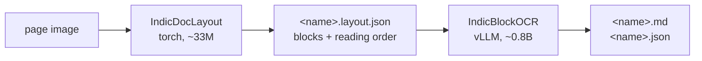

# IndicOCR end to end

This page covers the main OCR workflows and a few failure modes that are easy to miss.



## Install

```bash
./install.sh && source .venv/bin/activate
```

OCR shares the one environment with TTS and MT. The recognizer's `vLLM >= 0.26` floor is
what sets the shared vLLM version.

The installer checks three things that otherwise fail without raising: `PPDocLayoutV3` importable,
`ninja` on PATH, and `torch.cuda.is_available()`. A wheel built for a newer CUDA than your driver
imports fine and then reports no GPU; rerun with a matching `CUDA_TAG=cu126`.

### If the resolver refuses to install vLLM

```
vllm==0.26.0 depends on tilelang==0.1.9 and tilelang==0.1.12
```

PyPI and the per-CUDA wheel index publish different dependencies for the same vLLM version, so a
range like `vllm>=0.26` lets the resolver see both and call it unsatisfiable. Pin the exact version
and prefer the versioned per-CUDA index, which is what `install.sh` does. Installing by hand:

```bash
uv pip install "vllm==0.26.0" \
    --extra-index-url https://wheels.vllm.ai/0.26.0/cu129 \
    --extra-index-url https://download.pytorch.org/whl/cu129 \
    --index-strategy unsafe-best-match
```

## Parse pages

```bash
python -m bodhan_genai.ocr.inference.cli parse pages/ -o out/          # or scripts/ocr/parse.sh
```

**For batch jobs, pass a folder rather than a page.** Loading IndicBlockOCR takes a few minutes;
every block of every page in the folder then goes through one continuous batch, so that cost is paid
once. Parsing 50 pages one at a time costs 50 engine startups.

Useful flags: `--save-layout` also writes the intermediate; `--table-format markdown` for flat
tables; `--dedup-mode`, `--min-px-side`, `--conf` to explore the recipe.

## The two stages separately

Stage 1 loads torch and nothing else — no vLLM, no recognizer weights — so it runs on a much
smaller GPU:

```bash
python -m bodhan_genai.ocr.inference.cli layout page.png -o out/
# inspect or hand-correct out/page.layout.json here
python -m bodhan_genai.ocr.inference.cli ocr out/page.layout.json -o out/
```

Overlay a layout on its page to see what was detected:

```bash
python examples/ocr/viz_layout.py out/page.layout.json pages/ viz/
```

## In Docker

The image carries its own CUDA, torch and vLLM, so nothing needs installing but Docker. It runs a
batch and exits.

```bash
scripts/ocr/parse_docker.sh --build pages/ out/
scripts/ocr/parse_docker.sh pages/ out/ --save-layout
```

Weights come from the Hub on first use, or from local checkpoints:

```bash
LAYOUT_CKPT=/path/to/layout RECOGNIZER_CKPT=/path/to/ocr \
    scripts/ocr/parse_docker.sh pages/ out/
```

Mount the caches so the download and the compiled kernels are paid once:
`HF_CACHE_DIR=~/.cache/huggingface`, `FLASHINFER_DIR=~/.cache/flashinfer`. With those warm, a run
needs no network at all (`HF_HUB_OFFLINE=1`).

## As a server

For pages arriving over time, or callers without a GPU, run the recognizer behind stock
`vllm serve` and keep layout client-side:

```bash
scripts/ocr/serve.sh                                          # GPU box
python -m bodhan_genai.ocr.serving.client pages/ -o out/      # anywhere
```

Full detail in [serving.md](serving.md).

## From Python

```python
from bodhan_genai.ocr import IndicOCR

with IndicOCR() as parser:
    page = parser.parse("page.png")
    print(page.markdown)
```

Or the stages, swapping either half:

```python
from bodhan_genai.ocr import IndicDocLayout, IndicBlockOCR

layout = IndicDocLayout().detect("page.png")  # stage 1 -> PageResult
result = IndicBlockOCR().run("page.png", layout)  # stage 2, layout may be your own
```

## Bringing your own layout

`LayoutBackend` is a runtime-checkable Protocol — two methods:

```python
class MyLayout:
    def detect(self, image) -> list[Block]: ...  # cleaned, order = 0..n-1, no gaps
    def close(self) -> None: ...
```

`isinstance(MyLayout(), LayoutBackend)` tells you whether the shape is right. Or skip the class
entirely and hand stage 2 a layout JSON of the documented schema.

**The one contract that matters:** `order` must be a gap-free 0-based rank. Stage 2 matches
transcriptions back to blocks by `order`, so a gap or a duplicate mis-assigns text to the wrong
block. `JsonLayoutBackend` renumbers for you, which is what makes a hand-edited layout safe.

## Things worth knowing

**Configuration drift.** Every tunable is a frozen dataclass with the shipped recipe as its
default, and nothing is read from the environment. Override through `LayoutConfig` / `DedupConfig`
/ `CropConfig` / `RecognizerConfig` explicitly.

**The benchmark config is not the shipped config.** The published 82.9 was measured with
`dedup_mode=text_only` and Markdown tables. The default is now `dedup_mode=both` with HTML tables.
See [model_card.md](model_card.md).

**Markdown tables lose merged cells.** `colspan`/`rowspan` have no GFM spelling. HTML is the
default for that reason; `--table-format markdown` is a deliberate downgrade.

**Blocks with empty text are not errors.** Figures and running headers are kept in the JSON with
`text: ""` by design, so downstream consumers can see them. Filter on `text` if you only want prose.

**Byte-exact comparisons need a fixed environment.** Decoding is greedy, so text is reproducible —
but box coordinates and confidences shift by ~1px / ~0.001 across torch builds. Compare within one
environment, or allow that tolerance.

**Caches default to `$HOME`, which is often a bad place on a cluster.** FlashInfer, Triton and
Hugging Face all write under the home directory unless told otherwise. On a shared node, that
directory may be small, near-full, or have restrictive permissions. The engine detects an unwritable
FlashInfer cache and redirects to a temp directory with a warning, but a temp directory does not
survive the node — so kernels recompile every run. Point them at real storage:

```bash
export FLASHINFER_WORKSPACE_BASE=/path/to/project/cache   # appends .cache/flashinfer
export TRITON_CACHE_DIR=/path/to/project/cache/triton
export HF_HOME=/path/to/project/hf_cache
```

## Reference

[model_card.md](model_card.md) · [contract.md](contract.md) · [configs.md](configs.md)
