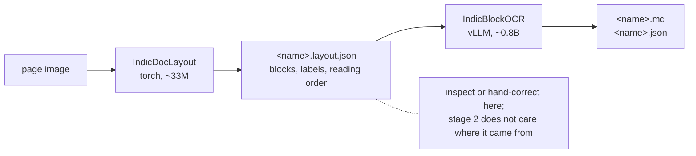

# OCR

**IndicOCR** — block-level document parsing for English and the 22 Eighth-Schedule Indian
languages. Page image in, reading-ordered Markdown and per-block JSON out.

Two models with a **plain-JSON handoff**: **IndicDocLayout** (our PP-DocLayoutV3 finetune with an
integrated reading-order head, ~33 M, PyTorch) and **IndicBlockOCR** (a Qwen3.5-0.8B recognizer on
the Sarvam tokenizer, bf16, vLLM). That boundary is the design: either half can be inspected,
hand-corrected or replaced without touching the other.



## Quick example

```python
from bodhan_genai.ocr import IndicOCR

with IndicOCR() as parser:
    print(parser.parse("page.png").markdown)
```

Pass a folder rather than a single page wherever you can. Loading IndicBlockOCR takes a few
minutes; every block of every page then goes through one continuous batch, so the startup cost is
paid once instead of per page.

!!! warning "Labels and types are different vocabularies, and mixing them fails silently"

    **Labels** are what IndicDocLayout emits (`ocr.layout.labels.CLASSES`), matched
    case-sensitively. **Types** are the coarse categories a label maps to, and they select the
    prompt. A label absent from `LABEL_TO_TYPE` falls through to `Text` *by design* — so a
    mis-cased or typo'd label does not raise, it quietly gets the prose prompt instead of the
    equation or table one. See [the contract](contract.md).

!!! note "OCR sets the shared vLLM version"

    `./install.sh` builds one `./.venv` for every modality. The recognizer's GDN kernels need
    `vllm >= 0.26`, which is what the shared environment now installs. That floor also fixes the
    install order for everyone: **vLLM first**, letting it pull its own matched torch, because
    pre-pinning torch leaves a half-installed torch behind on 0.26.

## In this section

- [End to end](end-to-end.md) — **start here**: every workflow on one page
- [The contract](contract.md) — prompts, block taxonomy, output schema
- [Data & training](training.md) — the corpus, the layout trainer, and both evals
- [Serving](serving.md) — stock `vllm serve` plus a client that owns layout
- [Configs](configs.md) — field-by-field config reference
- [Model card](model_card.md) — what the models are, and what they were measured on
- [API reference](../reference/ocr.md) — classes and functions

Full package documentation, including quickstart and troubleshooting, lives in
[`src/bodhan_genai/ocr/README.md`](https://github.com/Bodhan-AI/bodhan_genai/blob/main/src/bodhan_genai/ocr/README.md).
