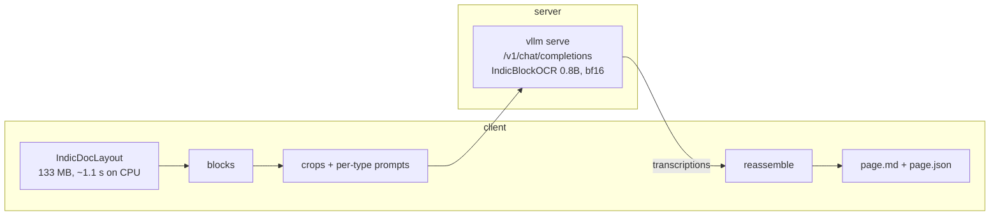

# Serving IndicOCR

## The endpoint serves the recognizer only

There is no custom server. `scripts/ocr/serve.sh` is a wrapper around stock `vllm serve` holding
**IndicBlockOCR**. **IndicDocLayout runs client-side**, because vLLM cannot serve a torch object
detector, and because the recognizer consumes block crops rather than pages.



!!! warning "Do not point a bare OpenAI client at this and send whole pages"

    Each request must be one block crop with the prompt its block type selects. Send a full page
    and you get plausible text that is not what the pipeline would produce, with no error.
    Use `OCRClient`, which owns that contract.

The messages `OCRClient` sends render, through the recognizer's chat template, to exactly the
prompt the offline path builds: the template branches on `'image' in item or 'image_url' in item`,
so OpenAI-style content and the local form collapse to the same string. Served output therefore
follows the offline path rather than approximating it.
`tests/ocr/test_serving_client.py` asserts this against the shipped template when
`BODHAN_OCR_RECOGNIZER_CKPT` is set (with `BODHAN_GENAI_DEPLOYMENT=1`, since the variable is
otherwise ignored).

## Files

| | |
| --- | --- |
| `scripts/ocr/serve.sh` | wrapper around `vllm serve`; writes `vllm-serve.info` |
| `ocr/serving/recognizer_http.py` | `HttpRecognizer`, a `RecognizerBackend` over HTTP |
| `ocr/serving/client.py` | `OCRClient` — layout locally, recognition remotely |

`HttpRecognizer` implements the same protocol as `VllmRecognizer` and `HfRecognizer`, so
`IndicBlockOCR` runs unchanged and every stage between the two models is shared code.

## Run

```bash
./install.sh && source .venv/bin/activate
scripts/ocr/serve.sh                      # background; waits for readiness
scripts/ocr/serve.sh --foreground         # stay in the foreground
```

The client needs neither vLLM nor a GPU:

```bash
pip install -e '.[ocr-serve]'
python -m bodhan_genai.ocr.serving.client pages/ -o out/
```

### Knobs (env)

| variable | default | |
| --- | --- | --- |
| `CHECKPOINT` | resolved from the Hub | a local `weights/ocr` directory |
| `SERVED_NAME` | `indic_ocr` | the name clients must ask for |
| `GPU` | `0` | becomes `CUDA_VISIBLE_DEVICES` |
| `PORT` | `8000` | moves if the port is taken; the real one lands in `vllm-serve.info` |
| `MAX_MODEL_LEN` | `8192` | matches `RecognizerConfig` |
| `GPU_MEMORY_UTILIZATION` | `0.90` | |
| `TENSOR_PARALLEL_SIZE` | `1` | needs that many devices in `GPU` |
| `DATA_PARALLEL_SIZE` | `1` | replicate across GPUs; the right knob for this model |
| `ENFORCE_EAGER` | `0` | `1` restores the offline configuration |
| `OCR_API_KEY` | unset (server is **open**) | opt in: bearer token the server then demands; see [Authentication](#authentication) |

The weights live in a `weights/ocr` subfolder, which `vllm serve` cannot address, so the script
resolves a local path through `ocr.engine.checkpoints.resolve_ckpt` first. That honours an
explicit `CHECKPOINT`, then the published default. Inside a deployment image
(`BODHAN_GENAI_DEPLOYMENT=1`) it also honours `BODHAN_OCR_RECOGNIZER_CKPT` and a bundled
`weights/` — see [Configs](configs.md#checkpoints) for why those are gated.

### Authentication

**Off by default** — a reference server starts with no arguments. Stock `vllm serve` enforces a
bearer token itself, so opting in needs nothing from us:

```bash
export OCR_API_KEY=$(openssl rand -hex 32)
scripts/ocr/serve.sh
```

The launcher hands it to vLLM as `VLLM_API_KEY` in the environment, **not** `--api-key` on the
command line: a process's argv is readable by any account on the node (`ps -eo args`), so the
flag would publish the token to every user on a shared box.

Clients send it the way every OpenAI SDK already does. OCR's `HttpRecognizer` reads `OCR_API_KEY` from the
environment, so exporting the same value you launched with is enough:

```bash
export OCR_API_KEY=<token>                       # picked up by the client
curl -H "Authorization: Bearer <token>" http://localhost:8000/v1/models
```

An open server ignores the header, so leaving the variable exported is harmless.

!!! warning "The open default binds `0.0.0.0`"
    Anyone who can reach the node can use the GPU behind it. A bearer token over plain HTTP is
    also readable in flight. Put a TLS reverse proxy in front, or bind to localhost and tunnel,
    for anything past a trusted network.

### Why each flag is there

- `--limit-mm-per-prompt '{"image":1}'` — one crop per request, as the pipeline sends them.
- `--max-model-len 8192` — matches `RecognizerConfig`; a longer window buys nothing since inputs
  are single blocks.
- `--mm-processor-cache-type shm` — shared-memory transfer of preprocessed images, from vLLM's
  Qwen3.5 recipe. The crops are all distinct, so this is about transfer cost rather than hit rate.
- `--no-enable-prefix-caching` — document parsing has no multi-turn prefix to reuse, so the
  hashing is pure overhead. vLLM's own PaddleOCR-VL recipe says to disable it for OCR; the
  Qwen3.5 recipe enables it, but that one is written for chat.
- `--trust-remote-code` — as `VllmRecognizer` passes it.
- **`--enforce-eager` is off here**, unlike the offline configuration. A batch job skips ~4
  minutes of `torch.compile` because it runs once; a server pays it once at startup and every
  request benefits. Measured: startup went 135s to 155s, and a two-page run went 45s to 20s.

Deliberately not set, from the Qwen3.5 recipe: `--enable-expert-parallel` (this checkpoint is
dense, no experts), `--speculative-config` with MTP (no `num_nextn_predict_layers`), and
`--reasoning-parser qwen3` (the chat template already closes `<think>` in the generation prompt,
and a parser would move the transcription into `reasoning_content`).

`DATA_PARALLEL_SIZE` rather than tensor parallel is how to use several GPUs: at 0.8B the model
fits on one, so replicate it. That is the knob to reach for on a benchmark sweep.

## Talk to it

```python
from bodhan_genai.ocr.serving import OCRClient

with OCRClient("http://localhost:8000/v1") as client:
    page = client.parse("page.png")
    print(page.markdown)
```

`OCRClient` takes the same config dataclasses as the offline engine, so a recipe transfers
unchanged. **Layout defaults to `device="cuda"`** — pass
`layout_config=LayoutConfig(device="cpu")` to run it on a client without a GPU, which is the
point of splitting layout from the recognizer in the first place.

Crops within a page go out concurrently (`num_workers`, default 32) so the server's continuous
batching sees them together. Pages are processed in sequence.

| flag | |
| --- | --- |
| `--num-workers` | crops in flight per page |
| `--device` | device for the layout stage (`cpu` by default) |
| `--save-layout` | also write `<name>.layout.json` |
| `--best-effort` | a failed crop yields empty text instead of failing the page |

## Serving or batch?

Startup dominates a single run: a measured container parse of two pages took 181s wall clock, of
which 32s was GPU work. Batch amortises that over one job; a server amortises it over the process
lifetime.

| | use |
| --- | --- |
| `inference.cli` / the container | a corpus you already have on disk |
| a server | pages arriving over time, or callers without a GPU |

## How close is served output to offline?

Measured on the two gallery pages, driving both recognizers from the *same* layout so the backend
is the only variable:

| page | character identity |
| --- | --- |
| English maths | 99.27% |
| Telugu novel | 99.94% |

Block counts and transcribed counts match exactly. Every difference is an isolated single-token
flip (`\frac{1}{1}` against `\frac{1}{2}`, `వెళ్ళెందుకు` against `పెళ్ళెందుకు`), and in at least
one case the served output is the correct one.

Both paths decode greedily and send an identical prompt. The flips come from batch composition:
offline puts every crop of a page in one `generate()` call, while the server schedules incoming
requests into whatever batch is in flight, and a different reduction order moves logits enough to
tip a near-tie. The same effect is documented between the `hf` and `vllm` backends. **Do not expect
byte equality between the two paths**, and do not compare a served run against an offline baseline
byte for byte.

**Running layout on CPU rather than GPU is a much larger source of difference**, and it dominates
any naive comparison. On the Telugu page it swapped two blocks' reading-order ranks, which
reorders whole paragraphs: end-to-end similarity against a GPU-layout offline run fell to 54%,
while the recognizer output for the same blocks was 99.94% identical. Hold the layout fixed, or
run it on the same device, before concluding anything about the recognizer.

## Troubleshooting

- **`no server serving 'IndicBlockOCR' at ...`** — nothing is listening, or it is serving a
  different name. `scripts/ocr/serve.sh` records the port it actually bound in `vllm-serve.info`,
  which matters when the default was taken.
- **Transcriptions look plausible but wrong, and blocks seem misaligned** — something is sending
  whole pages rather than crops. The endpoint has no way to detect this.
- **`N/M crops failed`** — the server dropped requests, usually a timeout under load. Lower
  `--num-workers`, raise `--timeout`, or pass `--best-effort` to keep the page.
- **401 from the server** — it is authenticated and your client is not. Export `OCR_API_KEY`
  (read by `HttpRecognizer` and `OCRClient`), or send `Authorization: Bearer <token>`.
- **Slower per page than the offline path** — expected with `--enforce-eager`. Drop it and pay
  the compile cost once at startup.
