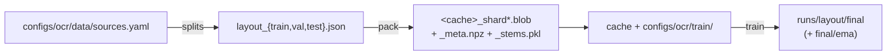

# Training IndicDocLayout

Detection and reading order, learned jointly in one pass.

!!! warning "Only the layout model is trained here"

    **IndicBlockOCR** — the 0.8B recognizer — ships as a released checkpoint, and this
    repo carries no recipe for it. There is no `ocr-train` path that reproduces it, and
    a plausible-looking one would be worse than saying so. What follows trains
    **IndicDocLayout**, the 33M detector with the integrated reading-order head.

Three steps, each writing what the next one reads:



```bash
scripts/ocr/splits.sh                    # manifests
scripts/ocr/pack.sh                      # the blob cache
scripts/ocr/train.sh --max-steps 20      # smoke-test the recipe
GPUS=0,1 scripts/ocr/train.sh            # the real run
scripts/ocr/eval.sh --ckpt runs/layout/final
```

---

## The corpus

The datasets are **not** shipped — they are large and separately licensed.
[`configs/ocr/data/sources.yaml`](https://github.com/Bodhan-AI/bodhan_genai/blob/main/configs/ocr/data/sources.yaml)
documents the seven sources and the on-disk layout each must be staged into:

```
<data_root>/<path>/
    images/<stem>.{png,jpg}
    jsons/<stem>.json
```

One JSON per page. **The bbox is `y` first, in thousandths** — the single easiest thing
here to get backwards:

```json
{
  "content": [
    {"bbox": [y0, x0, y1, x1], "label": "Paragraph", "reading_order": 1}
  ],
  "metadata": {"header": {"bbox": [...]}, "footer": {"bbox": [...]}}
}
```

`label` must be one of the 37 classes in `bodhan_genai.ocr.data.taxonomy`. Anything else
is **dropped silently**: the taxonomy is a closed set, and the parser cannot tell a typo
from a class this source legitimately does not annotate.

### Splits

Each source declares its own policy, because they do not all admit the same one:

| policy | when to use it |
| --- | --- |
| `native` | the source ships `manifest_by_split.json`. Use it, or its numbers stop being comparable with previously published ones. |
| `holdout` | a val/test set was fixed before this pipeline existed and models have already been measured against it. Pin those stems. |
| `hash` | a fresh deterministic 80/10/10 on `md5(stem)`. |

`md5` and not the builtin `hash()`: the builtin is salted per process, so a rebuild would
reshuffle the split and quietly move test pages into train.

The unit of disjointness is the page stem. For one-page-per-document scans that is
document-disjoint; for anything multi-page the document id must be a stem prefix, and
`check_prefix_disjoint` warns when a prefix straddles two splits.

### Count before you train

```bash
python -m bodhan_genai.ocr.data.summarize --manifest data/manifests/layout_train.json
```

37 classes across partially-annotated sources means some classes may have almost no
examples — magazine furniture exists in one source only, handwritten sets have no `Code`
blocks. A class with forty instances trains to noise, and counting is the only way to
learn that before a multi-day run rather than after it.

---

## The packed cache

Training reads every page every epoch. Held as loose files that is two filesystem opens
per page per epoch, which on a shared parallel filesystem costs more than the forward
pass. `scripts/ocr/pack.sh` packs them once:

* `<cache>_shard000.blob` — JPEG bytes, concatenated, no framing
* `<cache>_meta.npz` — where each page lives, plus its parsed labels, flat with an
  offsets array so DataLoader workers inherit it through fork instead of copying
* `<cache>_stems.pkl` — page stems in index order

Pages that fail to open, or that parse to zero boxes, are skipped with a warning.
`PackStats.skipped` is how a pack that quietly dropped a tenth of the corpus becomes
visible.

---

## The objective

Detection uses the base RT-DETR loss. Reading order adds a **locality-weighted
Generalized Cross-Entropy** on the antisymmetric pairwise score matrix, where
`S[i, j] > 0` means query *i* precedes *j*:

* **GCE rather than BCE** — reading-order annotation is genuinely ambiguous on
  multi-column pages, and `q` bounds what a single confidently-wrong pair contributes.
* **Locality weighting** — pairs are weighted `exp(-|Δrank| / tau)`. Getting neighbours
  in the wrong order is what a reader notices; getting block 2 against block 40 is not.
* **Upper triangle only** — PP-DocLayoutV3's GlobalPointer head masks `a >= b` to
  `-1e4`, so the lower triangle carries no real score and training it penalizes entries
  the model cannot fix.

Order loss is computed only over queries the Hungarian matcher assigned to real boxes.
The other ~300 queries have no ground-truth rank at all.

### What the warm start buys

Backbone, encoder, decoder, mask **and order** heads all come from the
document-pretrained checkpoint. Only the classification heads are re-initialized, because
PaddleX's taxonomy is not ours. Training the order head from scratch throws away the one
part of PP-DocLayoutV3 that is genuinely hard to reproduce.

!!! note "Two settings that are load-bearing"

    `backbone_learning_rate` is an order of magnitude below the head rate — the backbone
    arrives pretrained, and driving it at the head's rate erases that within a few
    hundred steps, after which the run never recovers to the warm start's quality.

    `max_grad_norm: 0.1` is deliberately tight. Hungarian matching makes the loss
    discontinuous: a step that flips an assignment produces a very large gradient, and
    without hard clipping one such batch can wreck an otherwise-converging run.

### The batch mix

`MixedSourceSampler` composes **every** batch to the configured per-source ratio rather
than shuffling a weighted pool. A weighted pool gives the right ratio in expectation over
an epoch, but any individual step can be almost all one source — and with gradient
accumulation across DDP ranks, that is what the optimizer sees. A source whose weight
rounds to zero pages per batch is reported rather than silently ignored.

### EMA

Both the live weights and the EMA shadow are written at every checkpoint, under
`final/` and `final/ema/`. EMA is usually the better model on this corpus but not always,
and re-running a multi-day job to find out is not an option. The decay warms up, because
early on the shadow is dominated by a near-random init that a fixed 0.9998 would take
tens of thousands of steps to forget.

---

## Evaluation

```bash
scripts/ocr/eval.sh --ckpt runs/layout/final
scripts/ocr/eval.sh --ckpt runs/layout/final/ema
```

This drives `IndicDocLayout` — the same backend inference and serving use — rather than
running its own forward pass. An eval with a private inference path skips the confidence
threshold, the dedup rules and the order decode, which is where several of this stack's
sharp edges live.

| metric | what it tells you |
| --- | --- |
| `mAP50`, `mAP50-95` | detection, COCO-style, one-to-one matching |
| `tau_model` vs `tau_raster` | reading order against the top-to-bottom baseline |
| `ned_model` | edit distance — catches one block moved far, which tau does not |
| `pairwise` | fraction of block pairs ordered correctly |
| **`tau_model_hard`** | the same, on pages where raster is *wrong* |

!!! warning "Read the hard slice"

    The raster baseline is very strong on single-column pages, so a model that has
    learned nothing about ordering still scores well in aggregate. `tau_model_hard` and
    `hard_pages` are where the order head either earns its place or does not.

Reading order is scored only over predictions matched to ground truth at IoU ≥ 0.5.
Ranking boxes the model invented, or missing ones it never found, is a detection failure
and is already counted as one.

### End to end

```bash
python -m bodhan_genai.ocr.eval.olmocr --pages bench/ --out runs/olmocr
```

Transcribes whole pages and scores them against the olmOCR benchmark.

!!! danger "The published number used non-default settings"

    IndicOCR's recorded olmOCR score of **82.9** was measured with
    `dedup_mode="text_only"` and **Markdown** tables. The shipped defaults are
    `dedup_mode="both"` and **HTML** tables — both deliberate, because HTML is the only
    way to express a merged cell — but the benchmark's references are flat Markdown, so
    the defaults measure a formatting mismatch rather than transcription quality.

    Those reproduction settings are what this command defaults to, and every run writes
    them into `settings.json` beside the predictions. Pass `--shipped-defaults` to score
    the defaults instead; the result is *not* comparable to the published number.

Scoring is delegated to the official `olmocr` package when installed. Re-implementing
someone else's benchmark metric is how you end up with a number that looks comparable and
is not.
