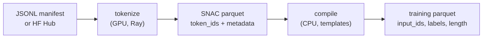

# Data pipeline

Two stages, both producing HuggingFace-compatible sharded Parquet with resume manifests. Audio is
SNAC-tokenized up front; training only ever sees token ids.



## Stage 1 — `python -m bodhan_genai.tts.data.tokenize`

```bash
python -m bodhan_genai.tts.data.tokenize --config configs/tts/data/tokenize.yaml
```

SNAC-encodes audio on GPU with Ray actors (`workers_per_gpu`, batched encode). Two input sources,
selectable per dataset entry:

### Input: JSONL manifest

One JSON object per line; the config's `columns:` block maps manifest field names onto the pipeline
schema:

| `columns:` key | maps to | notes |
|---|---|---|
| `audio` | audio filepath to encode | default `audio_filepath` |
| `text` | transcript | default `text` |
| `language` | language code | default `language` |
| `speaker` | speaker id | optional; keep it if you want speaker-conditioned SFT |
| `style` / `accent` | style / accent tags | optional |
| `audio_caption` | free-text voice description | optional |

### Input: HF Hub dataset

Set `hf_dataset` / `subset` / `split` instead of `jsonl`; the `audio` column must be an HF `Audio`
feature (decoded arrays are encoded directly, no filepaths needed).

### Output schema (8 columns)

| column | type | content |
|---|---|---|
| `text` | string | transcript |
| `token_ids` | list\<int32\> | interleaved SNAC audio token ids (deduped frames) |
| `language` | string | language code |
| `speaker` | string | speaker id ("" if unmapped) |
| `style` | string | style tag |
| `accent` | string | accent tag |
| `audio_caption` | string | voice description |
| `audio_filepath` | string | the row's own source path (provenance / debugging) |

### Resume manifest

Each output dir gets a manifest JSON tracking per-shard status. Shards are written atomically
(`.tmp` + rename); on restart, `done` shards are skipped and only pending/failed shards re-run.
Stale manifest entries (input set changed between runs) are dropped rather than silently reused.

## Stage 2 — `python -m bodhan_genai.tts.data.compile`

```bash
python -m bodhan_genai.tts.data.compile --config configs/tts/data/compile.yaml
```

Reads stage-1 parquet and applies the chat templates in `bodhan_genai.tts.templates.chat` to every row
via `build_sequence(entry, tokenizer)`.

### Template dispatch

| condition on the row | template |
|---|---|
| `is_conversation` truthy | **conversation** — pre-formatted multi-turn text → audio |
| otherwise | **basic TTS** — (optional speaker/style wrappers +) text → audio |

Labels are a full copy of `input_ids` — **full-sequence loss**, no prompt masking.

### Conversation rows

Rows with `is_conversation: true` carry pre-formatted multi-turn `text` built by the helpers in
`bodhan_genai.tts.templates.conversation`, using the `<|speaker>S1<speaker|>` turn format (each turn is
wrapped in speaker tags; `token_ids` holds the target turn's audio). The conversation template
tokenizes that text verbatim inside the human span.

### Output schema

| column | type |
|---|---|
| `input_ids` | list\<int32\> |
| `labels` | list\<int32\> (== input_ids) |
| `length` | int32 |

Rows are written **sorted length-descending**. First-Fit-Decreasing packing in the trainer wants
long sequences first — sorting at compile time makes packing deterministic across runs and avoids
a full-dataset sort at training startup.

Stage 2 also writes a `compile_manifest.json` with the same skip-completed-shards resume behavior
as stage 1.
