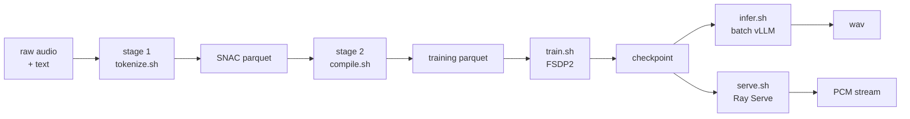

# IndicSpeak end to end

One ordered pass from raw audio to a streaming server. Every command is runnable as written; the
deep dives are linked at each step.



---

## 1. Install

```bash
./install.sh --extras all-tts        # or plain ./install.sh for every modality
source .venv/bin/activate
```

Training additionally needs flash-attn, which the installer builds from source. On a box that
only serves or runs inference, `./install.sh --no-flash-attn` skips a long compile.

## 2. Stage 1 — tokenize audio

SNAC-tokenises audio datasets to sharded Parquet, distributed with Ray.

```bash
scripts/tts/tokenize.sh                                  # configs/tts/data/tokenize.yaml
scripts/tts/tokenize.sh configs/tts/data/tokenize.yaml --some-override
```

`RAY_ADDRESS` defaults to `local`; point it at a cluster to fan out.

## 3. Stage 2 — compile training sequences

```bash
scripts/tts/compile.sh                                   # configs/tts/data/compile.yaml
```

Turns tokenized Parquet into training-ready sequences in the frozen token layout. **Read
[Token layout](token_layout.md) before changing anything here** — the layout is frozen, and a
mismatch between what compile writes and what the model expects produces audio-shaped noise
rather than an error.

Details: [Data pipeline](data_pipeline.md).

## 4. Train

```bash
scripts/tts/train.sh                                     # configs/tts/train/pretrain.yaml
scripts/tts/train.sh configs/tts/train/sft.yaml
NUM_GPUS=4 scripts/tts/train.sh configs/tts/train/sft.yaml
```

Relaunching with the same `training.output_dir` **auto-resumes** from the last checkpoint.

LoRA instead of full fine-tuning:

```bash
scripts/tts/train_lora.sh configs/tts/train/lora.yaml
```

Sequence packing, the FSDP2 config, and the two settings that silently cost you throughput:
[Training](training.md).

## 5. Batch inference

```bash
scripts/tts/infer.sh --jsonl-path manifests/eval.jsonl --output_dir out/eval_run
```

Defaults come from `configs/tts/infer/offline_vllm.yaml`; any flag given here overrides the
config — e.g. `--checkpoint_path <your SFT checkpoint>`.

Or in Python:

```python
from bodhan_genai.tts import IndicTTSEngine

IndicTTSEngine("/path/to/checkpoint").synthesize("Hello world", speaker="S1").save("hi.wav")
```

Long-form text should go through the chunked path rather than one giant call — see
[Inference](inference.md).

## 6. Serve

```bash
./scripts/tts/serve.sh
CHECKPOINT=/path/to/my-ckpt PORT=8000 ./scripts/tts/serve.sh
```

One merged WS-ingress + vLLM AsyncLLM + in-process SNAC replica per GPU. Three endpoints: offline
POST, `/tts` stream, `/tts/chunked`.

| env | default | note |
|---|---|---|
| `CHECKPOINT` | `bodhan-ai/indic-speak` | public; pass a local path to work offline |
| `TOKENIZER` | `$CHECKPOINT` | |
| `SNAC` | `hubertsiuzdak/snac_24khz` | |
| `NUM_REPLICAS` | GPU count | |
| `PORT` | `8000` | |

Protocol and topology: [Serving](serving.md).

## 7. Qualify a build

```bash
python -m bodhan_genai.tts.engine.chunk_harness --text-file chapter.txt --max-chars 300
```

Chunk-plan sanity needs no GPU and exits non-zero on hard cuts or over-ceiling chunks, so it runs
as a content-ingest CI step. The full deployment gates are in
[Release qualification](release.md).

For model quality rather than build safety, see [Evaluation](eval.md) — and note the harness
behind the published numbers does not ship in this repo.

## Related

- [Token layout](token_layout.md) — the frozen SNAC layout, read before touching stage 2
- [Configs](configs.md) — every field
- [Troubleshooting](../troubleshooting.md) — when the environment is the problem
