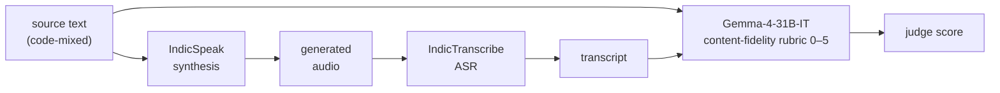

# Evaluating IndicSpeak

The **numbers** live in the
[package README](https://github.com/Bodhan-AI/bodhan_genai/blob/main/src/bodhan_genai/tts/README.md#evaluation)
— that is the canonical doc for the model. This page is how you would produce them, and what the
repo does and does not give you for that.

!!! warning "The content-fidelity harness does not ship in this repo"

    The judge pipeline behind the README's tables — recognise each generated reading with
    IndicTranscribe, grade the transcript against the source text with Gemma-4-31B-IT — is **not
    code in this package**, and no script here reproduces it. It is reconstructed below from the
    method the README documents so the shape is clear, but you will be assembling it yourself.

    What *does* ship is [release qualification](release.md): a deterministic gate over a fixed
    golden set. That answers "is this build safe to promote", not "how good is this model".

## What the reported metric measures



**Content fidelity only** — whether the words came out right. Naturalness, speaker similarity and
prosody are not measured. Two models sit inside the metric, so their errors land in the number:
IndicTranscribe mistakes and Gemma-4 grading noise both count against the system under test.

Corpus in the published run: 30,000 readings — 15,000 code-mixed sentences × 2 voices, 283 hours.

## Reproducing it

### 1. Synthesize the corpus

```python
from bodhan_genai.tts import IndicTTSEngine

engine = IndicTTSEngine("/path/to/checkpoint")
for row in corpus:  # {"text": ..., "speaker": ...}
    engine.synthesize(row["text"], speaker=row["speaker"]).save(f"out/{row['id']}.wav")
```

For 30k readings use the batch path rather than a Python loop — see
[Inference](inference.md) for the two-phase vLLM runner.

Hold **temperature fixed** across arms. A judge score compared between two sampling
configurations measures the sampler, not the checkpoint.

### 2. Recognise

```bash
python -m bodhan_genai.asr.inference.transcribe \
    --manifest readings.jsonl --model-dir /path/to/indic-transcribe-hf --out-dir hyp/
```

The manifest needs a `language` per row. A wrong label produces confidently wrong *script*, which
the judge will score as a content failure that belongs to the recogniser, not to IndicSpeak. See
[ASR caveats](../asr/caveats.md).

### 3. Judge

Grade each `(source text, transcript)` pair with Gemma-4-31B-IT on a 0–5 content-fidelity rubric.
Serving that model is a plain `vllm serve`; the
[MT serving page](../mt/serving.md) covers the same pattern.

### 4. Aggregate

Report **both** the mean judge score and the top-band (scored 5) rate. They separate different
things: the mean moves with the tail, the top-band rate with the bulk. The README's tables carry
both for exactly that reason.

## Reading the result

!!! danger "Measurement uncertainty is about ±0.9 points of top-band rate"

    The ten benchmarked languages span 92.0%–93.6% — a 1.6-point spread against roughly ±0.9
    uncertainty. **They are not meaningfully separated.** Treat small per-language differences as
    noise, and do not build a language-quality ranking out of them.

Two effects in the published run *are* larger than the noise:

- **Cross-lingual casting costs about 3 points** of top-band rate (95.7% native vs 92.9%
  cross-lingual). Using a voice outside its own language is measurably worse.
- **Voice spread is real at the bottom.** The weakest voice scores 4.532 against a 4.901 mean.

Coverage is **10 of 22 languages**. The other twelve have voices and playable audio but no scored
evidence — absence of a number is not evidence of quality.

## Related

- [Release qualification](release.md) — the deterministic gate that *does* ship
- [Training](training.md) · [Inference](inference.md) · [Configs](configs.md)
