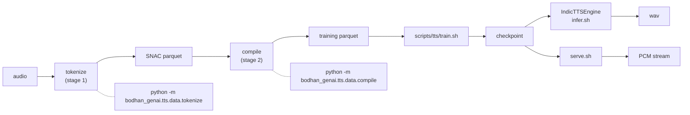

# TTS

Orpheus-style LLM text-to-speech: a **Llama-3.2-3B** causal-LM backbone that emits discrete
[SNAC 24 kHz](https://github.com/hubertsiuzdak/snac) codec tokens. Training and inference are
**token-in, token-out** — all audio encode/decode happens in the offline data pipeline or in the
serving layer, never inside the training loop.



## Quick example

```python
from bodhan_genai.tts import IndicTTSEngine

engine = IndicTTSEngine()  # defaults to bodhan-ai/indic-speak + the fine-tuned Vocos decoder
engine.synthesize("Hello world", speaker="S1").save("hello.wav")
```

The default checkpoint is a public Hub repo, so this needs no credentials —
`bodhan-ai/indic-speak` in the environment; pass a local path (`IndicTTSEngine("/path/to/checkpoint")`)
to skip the Hub. See [Inference](inference.md) for every entry point and the decoder knob.

## Prerequisite

This repo **does not create tokenizers**. Every stage needs a Llama-3 tokenizer already extended
with the frozen audio-token layout — see [token layout](token_layout.md).

## In this section

- [Token layout](token_layout.md) — the frozen SNAC token contract and 7-token frame interleave
- [Data pipeline](data_pipeline.md) — stage 1 tokenize, stage 2 compile
- [Inference](inference.md) — entry points, default models, the Vocos/SNAC decoder knob
- [Serving](serving.md) — the Ray Serve streaming server and its three endpoints
- [Configs](configs.md) — field-by-field config reference
- [Release qualification](release.md) — deployment gates
- [API reference](../reference/tts.md) — classes and functions

Full package documentation, including quickstart and troubleshooting, lives in
[`src/bodhan_genai/tts/README.md`](https://github.com/AshwinSankar17/bodhan_gen_ai_tools/blob/master/src/bodhan_genai/tts/README.md).
