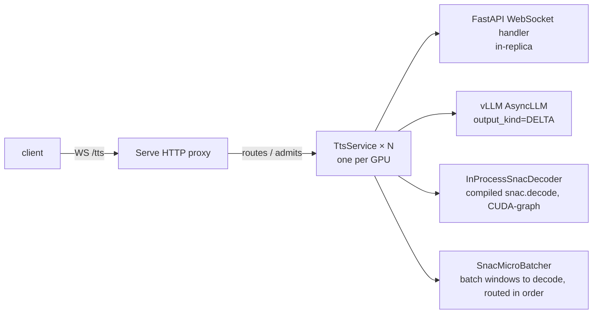

# Real-time streaming TTS serving

`python -m bodhan_genai.tts.serving.app` runs a live TTS server with three synthesis endpoints
(streaming, chunked streaming, offline — see [Endpoints](#endpoints)) on one engine: a client
sends text, the LLM streams SNAC audio
tokens, an **in-process** SNAC decoder turns them into 24 kHz audio, and PCM frames stream back —
packet by packet, under a real-time latency budget.

## Architecture



One **replica == one GPU == one vLLM AsyncLLM engine + one compiled SNAC decoder**, co-located in a
single process/CUDA context. The websocket handler runs *inside* the replica (merged ingress), so
decoded PCM goes engine → SNAC → socket with no replica→ingress relay hop, and SNAC window jobs
never cross a process boundary (no Ray serialization). Ray Serve provides routing across replicas
and per-replica admission control (`max_ongoing_requests`).

Per request: `AsyncLLM.generate(..., DELTA)` → `StreamingWindower` turns new tokens into fixed
frame windows → `SnacMicroBatcher` decodes a fixed-size batch and scatters int16 frames back in
emit order → frames are grouped (`frames_per_message`; the first frame ships alone for low TTFP)
and streamed to the client.

Why this shape (from benchmarking the source system):

- **DELTA tokens** — process only new tokens per step, not the cumulative list.
- **In-process SNAC** — the decode bottleneck was Ray-serializing window dicts, not GPU compute;
  co-location removes the transport entirely.
- **Admission control** — cap in-flight per replica instead of flooding.
- **Co-location** — SNAC steals only ~5% of a GPU, so LLM+SNAC per GPU beats dedicated SNAC GPUs.

## Library use

The streaming hot path (AsyncLLM + windower + in-process SNAC micro-batcher) lives in
`bodhan_genai.tts.engine.streaming.IndicStreamingTTSEngine`; `TtsReplica` is now a thin Ray Serve
adapter over it. For standalone streaming without Ray Serve, instantiate the engine directly:

```python
from bodhan_genai.tts import IndicStreamingTTSEngine

engine = IndicStreamingTTSEngine("/path/to/checkpoint")
async for pcm in engine.stream("Hello world", speaker="S1"):
    ...  # raw int16 LE PCM @ 24 kHz
```

(`engine.stream_sync(...)` is the blocking equivalent for scripts.)

## Files

| module (`bodhan_genai.tts.serving.`) | role |
|---|---|
| `config` | `ServeConfig` + arg parsing (engine/SNAC/sampling/topology knobs) |
| `protocol` | `SynthesisRequest` + JSON control frames (`start`/`end`/`error`); audio = raw int16 LE PCM @ 24 kHz |
| `windower` | `StreamingWindower` — incremental DELTA tokens → fixed-frame windows (pure numpy) |
| `snac_streamer` | `InProcessSnacDecoder` + `SnacMicroBatcher` (ordered, fixed-batch CUDA-graph decode) |
| `replica` | `TtsReplica` — AsyncLLM + SNAC co-located; `synthesize` async-gen of PCM frames |
| `service` | `TtsService(TtsReplica)` — merged deployment: FastAPI `WS /tts`, `WS /tts/chunked`, `POST /tts/offline`, `GET /health` in the replica process; optional background WAV recorder pool |
| `app` | builds + runs the Serve app (entry point of `python -m bodhan_genai.tts.serving.app`) |

## Run

```bash
CHECKPOINT=/path/to/checkpoint scripts/tts/serve.sh
```

`scripts/tts/serve.sh` exports the required env and launches `python -m bodhan_genai.tts.serving.app`:

| env var | default | meaning |
|---|---|---|
| `CHECKPOINT` | `bodhan-ai/indic-speak` | model checkpoint path or HF id; the default is a public Hub id, so no credentials are needed |
| `PORT` | 8000 | websocket port |
| `NUM_REPLICAS` | auto (GPU count) | replicas, one per GPU |
| `RAY_ADDRESS` | `local` | must stay `local` — single-node, in-process Ray |
| `VLLM_ENABLE_V1_MULTIPROCESSING` | `0` | AsyncLLM and SNAC must share one process/CUDA context |

The Docker wrapper (`scripts/tts/serve_docker.sh`) sets `HF_HUB_OFFLINE=1` and mounts local
weights, so inside the container the checkpoint must be a mounted path, never a Hub id.

Server base: `<node>:8000` (endpoints below). Then:

```bash
python examples/tts/streaming_client.py --mode stream  --text "..." --out out.wav   # WS /tts
python examples/tts/streaming_client.py --mode chunked --text "..." --out out.wav   # WS /tts/chunked
python examples/tts/streaming_client.py --mode offline --text "..." --out out.wav   # POST /tts/offline
```

The model is **speaker-conditioned** — pass a real `speaker`; an empty speaker can yield no audio.

## Knobs

- `num_replicas` — auto-detected from visible GPUs; one replica per GPU.
- `gpu_memory_utilization` (default 0.85) — vLLM's slice of VRAM. The remainder is **SNAC
  headroom**: the compiled decoder + CUDA graphs live on the same GPU. Raising it above ~0.9
  starves SNAC and crashes graph capture.
- `snac_window_frames` — 3 vs 4 frame windows. 3 lowers time-to-first-packet (~85 ms less
  buffering) at slightly worse decode efficiency and more boundary overlap work; 4 is the
  throughput-friendly Orpheus default.
- `frames_per_message` (default 2) — frames grouped per websocket message (1 frame = ~85 ms of
  audio); cuts Serve/ingress per-message overhead. The first frame always ships alone for low TTFB.
- `snac_cudagraph_batch` / `snac_flush_interval_ms` — micro-batcher: fixed CUDA-graph batch size
  and max wait before a partial batch is flushed.
- fp8 options — `kv_cache_dtype=fp8` and fp8 weight quantization trade a small quality delta for
  more KV headroom / concurrency per replica; leave off unless capacity-bound.
- `max_ongoing_requests` (default 16) — per-replica admission cap.
- Sampling: `temperature` (0.7), `top_p` (0.8), `max_new_tokens`.

## Endpoints

One server, one engine per GPU replica, three synthesis endpoints:

| endpoint | transport | behavior |
|---|---|---|
| `/tts` | websocket | live streaming; per-request `"chunked": true` still honored |
| `/tts/chunked` | websocket | long-form chunked streaming (chunked routing forced) |
| `/tts/offline` | HTTP POST | complete utterance: JSON request in → `audio/wav` bytes out |
| `/health` | HTTP GET | readiness probe |

Offline example (response can be tens of MB for long chunked text; duration in
the `X-Audio-Duration-S` header):

```bash
curl -s -X POST http://<node>:8000/tts/offline \
  -H 'content-type: application/json' \
  -d '{"text": "नमस्ते दुनिया", "speaker": "Amit"}' -o out.wav
```

The bundled client drives all three: `python -m bodhan_genai.tts.serving.client
--mode {stream,chunked,offline} --text "..." --out out.wav`.

## Websocket protocol

1. Client sends one JSON request: `{"text": "...", "speaker": "<id>", ...optional sampling}`.
   Optional `"chunked": true` requests long-form chunked synthesis
   (`ChunkedIndicStreamingTTS`: sentence-split → per-chunk synthesis → consistent volume with
   250 ms gaps); the server-side default is `--chunked_default`, and the chunk/loudness knobs are
   the `--chunk_*` flags. In chunked mode, binary messages are **variable-length** PCM (grouped
   frames plus inter-chunk silence gaps — not fixed 4096-byte frames), and the `end` frame's
   `n_frames`/`audio_dur_s` include the gap silence.
2. Server replies with a JSON **`start`** frame (request id, sample rate 24000).
3. Server streams **binary** frames: raw little-endian **int16 PCM @ 24 kHz**, no header.
4. On completion, a JSON **`end`** frame (frame/token counts); on failure, a JSON **`error`**
   frame with a message. JSON frames are text messages; audio is always binary.

## Load testing

Internal tooling, not part of the public tree — ask a maintainer for the runbook.
