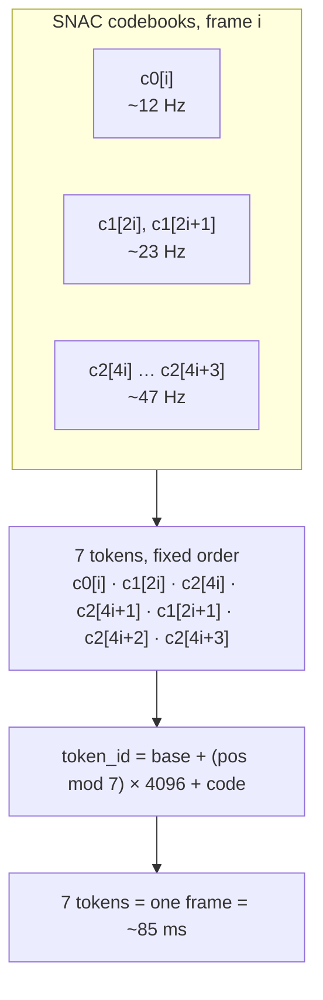

# Frozen token layout

The tokenizer contract is **frozen**: every checkpoint, dataset, and serving deployment in this
repo assumes the extended Llama-3 tokenizer below. This repo never creates or modifies tokenizers.
Tests and docs may state the literal ids; **runtime code must always resolve ids from the
tokenizer** (see the base-id rule at the bottom).

## Structural tokens

| id | token | role |
|---|---|---|
| 128000 | `<|begin_of_text|>` | bos |
| 128009 | `<|eot_id|>` | end of turn / generation stop |
| 128256 | *(reserved)* | start of the extension block |
| 128257 | `<|start_of_speech|>` | opens an audio-token span |
| 128258 | `<|end_of_speech|>` | closes an audio-token span |
| 128259 | `<|start_of_human|>` | opens a human turn |
| 128260 | `<|end_of_human|>` | closes a human turn |
| 128261 | `<|start_of_ai|>` | opens a model turn |
| 128262 | `<|end_of_ai|>` | closes a model turn |
| 128263 | `<|pad|>` | padding |
| 128264–128265 | *(reserved)* | unused |

## SNAC audio tokens

| range | count | meaning |
|---|---|---|
| 128266 – 156937 | 28,672 (= 7 × 4096) | SNAC codes; `<|snac_0|>` = 128266 is the base |

## Speaker / style wrappers

| id | token |
|---|---|
| 156938 | `<|speaker>` (speaker_start) |
| 156939 | `<speaker|>` (speaker_end) |
| 156940 | `<|style>` (style_start) |
| 156941 | `<style|>` (style_end) |

Total: `len(tokenizer) == 156942`.

## SNAC frame interleave

SNAC 24 kHz produces 3 codebooks at 1:2:4 temporal rates (each entry in 0..4095):

```
c0: [N]     (~12 Hz, coarsest)
c1: [2N]    (~23 Hz)
c2: [4N]    (~47 Hz, finest)
```

The interleave is the part that gets implemented wrong, so here it is as a picture — one frame
draws from all three codebooks at their own rates:



Each frame `i` becomes **7 tokens** in this fixed order:

| position in frame | code |
|---|---|
| 0 | `c0[i]` |
| 1 | `c1[2i]` |
| 2 | `c2[4i]` |
| 3 | `c2[4i+1]` |
| 4 | `c1[2i+1]` |
| 5 | `c2[4i+2]` |
| 6 | `c2[4i+3]` |

Each position owns a disjoint 4096-wide id band:

```
token_id = audio_token_base_id + (pos % 7) * 4096 + code
```

where `pos` is the flat index in the interleaved stream, so `pos % 7` is the position within the
frame. One frame = 7 tokens = ~85 ms of audio.

## Duplicate-frame dedup

During encoding, a frame whose `c0[i]` equals the previous frame's `c0[i-1]` is dropped entirely
(all 7 tokens). This compresses silence and steady-state segments; decoding simply plays the
remaining frames back-to-back.

## Decode range guard

Before decoding, every token is checked against `[base, base + 28672)`; out-of-range ids
(structural tokens, text leakage) are rejected rather than wrapped, and each token's band must
match its `pos % 7` slot. Malformed windows are dropped, not decoded into noise.

## Base-id resolution rule

Code must obtain the audio base id as

```python
audio_token_base_id = tokenizer.convert_tokens_to_ids("<|snac_0|>")
```

— never the literal `128266`. Checkpoints can ship tokenizers with slightly different vocab tails
(see the vocab-mismatch trap in the README); resolving from the tokenizer keeps encode/decode
consistent with whatever tokenizer the checkpoint was actually trained with. The same applies to
all structural ids: use `bodhan_genai.tts.templates.chat.get_template_ids(tokenizer)` /
`bodhan_genai.tts.inference.prompts.resolve_snac_ids(tokenizer)`.
