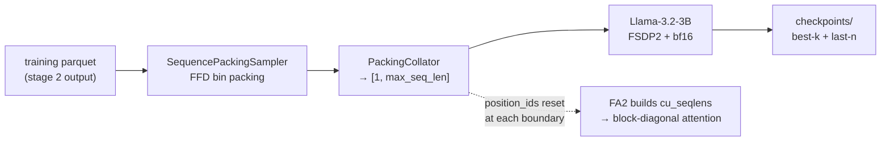

# Training IndicSpeak

Full fine-tuning and pretraining run through `scripts/tts/train.sh`; LoRA through
`scripts/tts/train_lora.sh`. Both wrap `accelerate launch` over an **FSDP2** config, feeding a
sequence-packing dataloader.



The data it consumes comes from the [data pipeline](data_pipeline.md) — tokenize (stage 1) then
compile (stage 2). This page starts where that ends.

---

## Run it

```bash
scripts/tts/train.sh                                   # configs/tts/train/pretrain.yaml
scripts/tts/train.sh configs/tts/train/sft.yaml
NUM_GPUS=4 scripts/tts/train.sh configs/tts/train/sft.yaml
```

`NUM_GPUS` defaults to the `nvidia-smi` count. `ACCELERATE_CONFIG` and `MASTER_PORT` override the
accelerate config and rendezvous port.

**Auto-resume is automatic**: relaunching with the same `training.output_dir` picks up the last
checkpoint (`get_last_checkpoint` in `train.py`). There is no `--resume` flag to forget.

Three configs ship: `pretrain.yaml`, `sft.yaml`, `lora.yaml`.

## Sequence packing

Utterance lengths in TTS vary widely, so padding every sample to a fixed length wastes most of
the batch. Two pieces avoid that.

**`SequencePackingSampler`** does First-Fit Decreasing bin packing, once per epoch:

1. Sub-sample indices from each constituent dataset proportionally to its ratio (`MixedDataset`).
2. Sort by sequence length, descending.
3. First-fit into bins of `max_seq_len` tokens.
4. Shard bins across ranks — `all_bins[rank::world_size]`.
5. Shuffle bin order within each rank.

FFD rather than online greedy because it is provably near-optimal (≤ 11/9 × OPT + 6/9 bins);
online greedy has no such guarantee and does worse on skewed length distributions, which is
exactly what TTS audio gives you.

Call `set_epoch(epoch)` before each epoch — it changes the sub-sampling seed, so each epoch packs
differently.

**`PackingCollator`** concatenates one bin into a single `[1, max_seq_len]` tensor. Static shapes,
so `torch.compile` sees one graph rather than one per length.

!!! info "How packed sequences avoid attending across each other"

    `position_ids` are **reset to 0 at each sequence boundary** inside a pack. Flash Attention 2
    detects those resets and internally builds `cu_seqlens` for `flash_attn_varlen_func`, which
    enforces block-diagonal attention. **No 2D attention mask is needed** — and none is built.

    This is why training requires flash-attn while inference and serving do not: the packing
    scheme depends on FA2's varlen path. `attn_implementation: "flash_attention_2"` is asserted,
    not merely preferred.

Padding within a pack: `input_ids` with `pad_token_id`, `labels` with `-100` (ignored by the
loss), `position_ids` with `0`, `attention_mask` `1` for real tokens and `0` for padding.

## FSDP2

`configs/tts/accelerate/single_node_fsdp.yaml`:

| setting | value | why |
|---|---|---|
| `fsdp_version` | `2` | |
| `fsdp_auto_wrap_policy` | `TRANSFORMER_BASED_WRAP` | wrapping `LlamaDecoderLayer` |
| `fsdp_activation_checkpointing` | `true` | ~30–40% throughput cost, roughly halves activation memory |
| `fsdp_reshard_after_forward` | `true` | |
| `fsdp_state_dict_type` | `FULL_STATE_DICT` | |
| `mixed_precision` | `bf16` | |

!!! danger "Never enable activation checkpointing in both places"

    FSDP owns it. Setting `model.activation_checkpointing: true` in a train YAML stacks HF-level
    gradient checkpointing on top, **doubling recompute for no benefit**. The shipped train YAMLs
    keep it `false`, and `train.py` warns if you change that.

Two knobs are deliberately absent: `fsdp_forward_prefetch` and `fsdp_sync_module_states` are
FSDP1-only and become **silent no-ops** under FSDP2 in accelerate 1.13. Setting them looks like
tuning and does nothing.

## What the launcher exports

`scripts/tts/train.sh` sets a compile- and NCCL-oriented environment before launching. The ones
worth knowing:

| variable | default | why |
|---|---|---|
| `TORCHINDUCTOR_MAX_AUTOTUNE` | `1` | the `max-autotune-no-cudagraphs` compile path |
| `TORCHINDUCTOR_FX_GRAPH_CACHE` | `1` | reuse compiled graphs across runs |
| `TORCH_NCCL_HEARTBEAT_TIMEOUT_SEC` | `3600` | **the first max-autotune pass can stall ranks for a long time**; a default heartbeat kills the job mid-compile |
| `PYTORCH_CUDA_ALLOC_CONF` | `expandable_segments:True` | fragmentation under varying pack sizes |
| `OMP_NUM_THREADS` | `nproc / NUM_GPUS` | |
| `WANDB_MODE` | `offline` | `wandb sync` the run directory later |

Air-gapped clusters: uncomment the `HF_HUB_OFFLINE` / `HF_DATASETS_OFFLINE` /
`TRANSFORMERS_OFFLINE` block at the top of the script. Models and tokenizers must already be
cached or local.

## Key config fields

From `configs/tts/train/pretrain.yaml`; the full field reference is in [Configs](configs.md).

| field | default | note |
|---|---|---|
| `model.model_path` | `bodhan-ai/indic-speak` | Hub id or local path |
| `model.tokenizer_path` | **required** | the extended audio tokenizer, 156942 tokens |
| `model.max_seq_len` | `8192` | the source production run used 34816 across 16 nodes |
| `model.attn_implementation` | `flash_attention_2` | required; see the packing note above |
| `model.compile` / `compile_mode` | `true` / `max-autotune-no-cudagraphs` | |
| `training.gradient_accumulation_steps` | `8` | |
| `training.learning_rate` | `1.0e-4` | cosine schedule, 500 warmup steps |
| `training.save_total_limit` | **must be `null`** | `BestAndLastCheckpointKeeper` owns retention; setting a limit fights it |
| `checkpoint_retention` | `last_n: 2`, `best_k: 2`, on `eval_loss` | |

## Install note

Training is the **only** part of IndicSpeak that needs flash-attn, and it is compiled from source
(PyPI ships [flash-attn](https://github.com/Dao-AILab/flash-attention) as an sdist with no wheel).
On a box that only serves or runs inference, `./install.sh --no-flash-attn` is correct.

## Next

- [Configs](configs.md) — every field
- [Release qualification](release.md) — the gate before a checkpoint ships
- [Evaluation](eval.md) — reproducing the numbers in the
  [package README](https://github.com/Bodhan-AI/bodhan_genai/blob/main/src/bodhan_genai/tts/README.md#evaluation)
