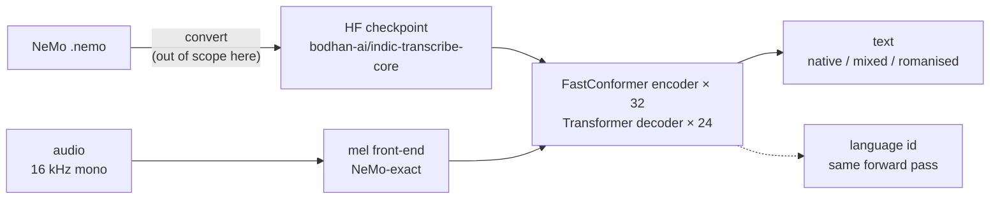

# IndicTranscribe — `bodhan_genai.asr`

Speech recognition for English and Indic languages, ported from NeMo. Audio in; a transcript in
native script, mixed script, or romanised — selected per request from **one** checkpoint.

An attention encoder-decoder (FastConformer encoder, transformer decoder), which is why streaming
here is **buffered, not frame-synchronous**: the latency floor is one decode interval, not one
frame. That is a property of the architecture, not of this implementation.

[Features](#features) · [Evaluation](#evaluation) · [Quickstart](#quickstart) ·
[Output modes](#output-modes) · [Language identification](#language-identification) ·
[Install](#install) · [Python API](#python-api) · [Serving](#serving) ·
[Configuration](#configuration) · [Caveats](#caveats)



> **No training stage.** IndicTranscribe is a port, not a model this repo trains — which is why
> its pipeline starts at a converted checkpoint where the other three start at data.

---

## Features

- **One checkpoint, three output modes** — native script, mixed script (ITN) or romanised,
  selected per request. Prompts are exactly 10 tokens in every mode, which is what keeps
  mixed-mode batches working.
- **Language identification from the same forward pass** — one decoder step over encoder states
  the transcription already computed, not a second pass.
- **Long-form chunking** on silences, above a 45 s threshold. Below it, audio is decoded whole;
  chunking shorter audio measurably hurts.
- **Two offline backends** — a gate-verified fixed batch (the only path with long-form chunking),
  and a continuous-batching engine ≈2.1× faster on a tuned comparison.
- **Buffered streaming server** — Ray Serve, one engine per GPU replica, websocket plus HTTP.
  32 concurrent sessions hold real time on one GPU.
- **No vLLM anywhere** — the whole stack is transformers + torch.

---

## Evaluation

> **Read [docs/asr/caveats.md](../../../docs/asr/caveats.md) before quoting any number from this
> section.** The scoring pitfalls documented there move WER further than the model does: on one
> corpus, raw **34.58% → 19.49%** once code-mixed script and Indic punctuation are normalised. A
> WER reported without stating those choices means nothing.

Settings validated against the pre-port pipeline:

| knob | value | evidence |
|---|---|---|
| dtype | **bf16** | WER-neutral vs fp32: −0.10% on 512 TTS utterances, −0.12% on 352 real recordings, 0.00% on sub-1 s clips |
| chunk window | **`--chunk-min 15 --chunk-max 25`** | best WER in the sweep; quality is flat across 10–30 s, so 10–15 s is a valid trade (~20% faster) |
| CPUs | **4–8 cores per GPU** | with 2 CPUs for 8 GPUs, per-shard encode time went 18 s → 437 s and per-GPU throughput fell 2.9× |

**Language identification is much weaker than the headline suggests.** The widely-quoted 96.9% is
*agreement with the NeMo detector*, not accuracy. Measured top-1 is **0.864** (lattice) and
**0.779** (VOI) over 337k clips, and the average hides a very uneven spread: `ml`/`ta` reach 0.979
while `bho` is **0.047**, `hi` **0.258**, `mai` 0.356 and `ur` 0.490. Do not use LID for
hi/bho/mai/ur if you have any metadata at all.

---

## Quickstart

```bash
scripts/asr/infer.sh --audio clips/ --lang hi -o out.jsonl
scripts/asr/serve.sh                      # Ray Serve: websocket streaming + HTTP batch
```

```python
from bodhan_genai.asr import IndicASREngine

with IndicASREngine("/path/to/checkpoint") as engine:
    print(engine.transcribe_batch(["clip.wav"], lang="hi"))
```

> **The model is language-conditioned and the transcription path has no LID of its own.** You
> supply `lang`. A wrong label produces *confidently wrong script*, not obvious garbage.

---

## Output modes

The frozen 10-token prompt carries two selectable slots. One checkpoint, three transcripts of the
same audio:

| call | slot 6 `itn` | slot 7 `romanized` | output |
| --- | --- | --- | --- |
| `transcribe_batch(...)` | off | off | native script, number-words, punctuation |
| `transcribe_batch(..., itn=True)` | on | off | mixed script + inverse text normalisation |
| `transcribe_batch(..., romanized=True)` | off | on | Latin |

Both default to `False`, which is the historical behaviour. Functionally verified across all three
modes on a live service; **not yet WER-evaluated** — treat mode choice as a formatting decision,
not a quality one.

---

## Language identification

`detect_language()` asks the model which language token belongs in the `source_lang` slot. It is
one decoder step over encoder states the transcription already computed, not a second pass.

```python
top = engine.detect_language(["unknown.wav"])  # [[('hi', 0.99), ('ur', 0.004), ...]]
```

**Pass a language if you have one.** Measured top-1 accuracy is **0.864** (lattice) and **0.779**
(VOI) over 337k clips — *not* the 96.9% that appears in some places, which is agreement with the
NeMo detector rather than accuracy. The average also hides a very uneven spread:

| strong | | weak — a neighbour absorbs them | |
| --- | --- | --- | --- |
| `ml` | 0.979 | `bho` | **0.047** |
| `ta` | 0.979 | `hi` | **0.258** |
| `kn` | 0.967 | `mai` | 0.356 |
| `bn` | 0.964 | `ur` | 0.490 |

**Do not use LID for hi/bho/mai/ur if you have any metadata at all.** Thresholding on the returned
probability does not rescue it: accuracy on surviving rows rises (0.779 → 0.836 at p≥0.7) but
coverage falls faster. Full analysis, including why restricting to the trained 27 languages changes
nothing, is in `bodhan_genai.asr.engine.lid`.

---

## Install

```bash
./install.sh --extras all-asr     # ASR alone; plain ./install.sh covers every modality
source .venv/bin/activate
```

ASR imports **no vLLM**, so unlike the other modalities it places no constraint on the vLLM line —
it follows the shared `torch 2.11.0+cu129` / `transformers 5.13.1` set rather than setting it.

Extras: `[asr-infer]` and `[asr-serve]`, aggregated as `[all-asr]`. There is no data or training
stage: the checkpoint is a port, and this repo does not train it.

Full install order and flags: **[the repository README](../../../README.md#install)**. If an
install went wrong: [docs/troubleshooting.md](../../../docs/troubleshooting.md).

---

## Python API

```python
from bodhan_genai.asr import IndicASREngine

engine = IndicASREngine(checkpoint)
engine.transcribe_batch(paths, lang="hi")  # native script
engine.transcribe_batch(paths, lang="hi", romanized=True)  # Latin
engine.transcribe_batch(paths)  # lang=None → LID fills it per row
engine.detect_language(paths)  # identify only
```

Also exported: `IndicTranscribeForConditionalGeneration`, `IndicTranscribeTokenizer`,
`IndicTranscribeFeatureExtractor` and `IndicTranscribeConfig`, for callers that want the model directly.

Long audio **must** be chunked — past ~60 s the decoder emits EOS early and degrades into
repetition. `--chunk-above 45` is the measured knee; see [caveats](#caveats).

---

## Serving

```bash
scripts/asr/serve.sh
```

Ray Serve, one replica per GPU: a websocket endpoint for buffered streaming and an HTTP endpoint
for batch. Language is resolved **per row**, so a request mixing Hindi and Tamil returns each in its
own script. Field-by-field reference: [docs/asr/serving.md](../../../docs/asr/serving.md).

---

## Configuration

The knobs that matter most, with the measurement behind each. Full reference:
**[docs/asr/configs.md](../../../docs/asr/configs.md)**.

| knob | default | note |
|---|---|---|
| `--max_ongoing_requests` | `32` | **Admission control.** 32 streaming sessions hold real time on one GPU; 36 drops to 14% and 40 to 0%. |
| `--stream_max_segment_s` | `5.0` s | The hard ceiling on time-to-first-text — the latency SLO knob, not a throughput knob. |
| `--stream_partial_interval_s` | `2.0` s | Interim text. Each partial is a full re-decode; `0` is cheapest. |
| `--chunk_above` | `45.0` s | Long-form threshold. Below it, decode whole. |
| `--batch_size` | `96` | Measured throughput knee on one H100. |
| `MODEL_DIR` | *(unset)* | Local directory or Hub repo id; unset resolves the public `bodhan-ai/indic-transcribe-core`. |
| `INDIC_TRANSCRIBE_PROFILE` | unset | `1` enables phase timers that add up. |

> **Raising `max_ongoing_requests` does not buy capacity.** Past the ceiling, sessions do not
> degrade one at a time — they share the GPU and all fall behind together.

---

## Troubleshooting

Environment problems — CUDA mismatch, the pip resolver, 401s on private repos — are shared across
every modality and live in **[docs/troubleshooting.md](../../../docs/troubleshooting.md)**.

IndicTranscribe-specific behaviour that looks like a bug and is not:

- **A wrong `lang` produces fluent output in the wrong script**, not an error. Transcription is
  language-conditioned and has no LID on that path.
- **Streaming yields nothing for up to 5 s** on a pause-free stretch. That is
  `--stream_max_segment_s`, and it follows from the architecture — see the note at the top.
- **Throughput collapses across all sessions at once** past the concurrency ceiling, rather than
  degrading one session at a time. See [Configuration](#configuration).
- **Per-shard encode time explodes on a CPU-starved node** — budget 4–8 cores per GPU.

---

## Caveats

[docs/asr/caveats.md](../../../docs/asr/caveats.md) is required reading before trusting any WER
number — the scoring pitfalls move WER further than the model does (34.58% → 19.49% on one corpus
once code-mixed script and Indic punctuation are handled). The short version:

- **Chunk past ~45 s.** Flat to 45 s, knee at 45–60 s, collapse beyond.
- **Code-mixed Latin script is the single biggest scoring artifact** — 75.3% of all substitutions.
- **Strip Indic punctuation by Unicode category, keeping `M*` marks.** A naive range regex keeps
  U+0964 DANDA and destroys vowel signs.
- **The encoder is not batch-composition invariant** — parity tests must freeze batch composition.

More: [model](../../../docs/asr/model.md) · [usage](../../../docs/asr/usage.md) ·
[serving](../../../docs/asr/serving.md) · [caveats](../../../docs/asr/caveats.md)
