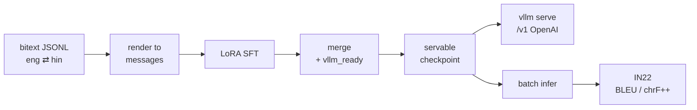

# IndicTranslate — `bodhan_genai.mt`

Translation between English and 22 Eighth-Schedule Indian languages (25 language-script
combinations, 44 directions). A decoder-only multimodal LLM
(`Gemma4ForConditionalGeneration`, base `google/gemma-4-E4B-it`, 7.94 B params bf16),
instruction-tuned for translation.

> Repo-level overview: [../../../README.md](../../../README.md)
> **New to MT? [docs/mt/end-to-end.md](../../../docs/mt/end-to-end.md) walks the whole pipeline in
> order, once.**

There are **no language tokens and no `forced_bos_token_id`**: the target language is an English
name interpolated into an instruction, and the source language is never named — the model infers
it. That is the whole API, and getting it wrong is the one failure mode that does not announce
itself.



## Contents

[Features](#features) · [Install](#install) · [The prompt contract](#the-prompt-contract) ·
[Python API](#python-api) · [Quickstart](#quickstart) · [Docker](#serve-with-docker) ·
[Configs](#configuration) · [Troubleshooting](#troubleshooting)

---

## Features

- **Public engine API** — `IndicMTEngine` with a `vllm` backend for throughput and an `hf` backend
  for a dependency-light reference run or an unmerged PEFT adapter. Greedy by default: the
  recommended setting for translation and the only reproducible one.
- **One prompt contract, enforced in code** — every path builds requests through
  `bodhan_genai.mt.templates.prompt`, so the target language is always named, the source never is,
  and there is always exactly one user turn.
- **Bitext → training data in one stage** — seeded instruction-phrasing variety, optional reverse
  direction, global dedup, train/dev split (`scripts/mt/render.sh`).
- **LoRA finetuning at 8k context** — TRL `SFTTrainer` + PEFT with an assistant-only loss mask, DDP
  via `accelerate` (`scripts/mt/train_lora.sh`), auto-resume, early stopping on `eval_loss`.
  **Provisional recipe** — see [docs/mt/training.md](../../../docs/mt/training.md).
- **Serving is stock `vllm serve`** — no custom server to maintain (`scripts/mt/serve.sh` is a
  wrapper), plus `MTClient`, a typed client that owns the prompt contract.
- **Checkpoint surgery for serving** — `tools.vllm_ready` adds the KV-shared `k_norm` tensors stock
  vLLM demands, so a checkpoint you trained loads unpatched.
- **IN22 score replication** — BLEU + chrF++ over 44 directions, with pooled and macro aggregates
  reported separately ([docs/mt/eval.md](../../../docs/mt/eval.md)).

## Evaluation

> **No system-level benchmark has been published for this checkpoint yet.**

IN22 BLEU/chrF++ over 22 languages in both directions is what the harness measures; the
procedure, the aggregation rules and the noise floor are in
[docs/mt/eval.md](../../../docs/mt/eval.md). Run it with `scripts/mt/eval.sh`.

Two things to settle **before** quoting any number from it:

- **chrF++ is `corpus_chrf(..., word_order=2)`.** Dropping `word_order` silently reports plain
  chrF, which looks close enough to pass a casual review.
- **Pooled and macro aggregates differ by about a point.** `metrics.json` reports both, named.
  Comparing one against the other is the most common way these numbers get misread.

What *has* been measured is the cost of getting the prompt wrong, and it dwarfs any plausible
model difference: prompting `"Sindhi"` instead of `"Sindhi (Devanagari script)"` scored
**6.67 vs 36.57 chrF++** — a 29.9-point drop, from output that still reads as fluent text. See
[the prompt contract](#the-prompt-contract).

## Install

```bash
./install.sh --extras all-mt      # or plain ./install.sh for every modality
source .venv/bin/activate
```

No flash-attn — IndicTranslate runs on `sdpa`. Extras: `[mt-data]`, `[mt-train]`, `[mt-infer]`,
`[mt-serve]`, aggregated as `[all-mt]`.

The installer gates on two checks that catch real failures: that `transformers` actually registers
the Gemma 4 architecture, and that `torch.cuda.is_available()` — a vLLM wheel built for a newer
CUDA than the driver imports cleanly and *then* silently reports no GPU.

The install order is load-bearing (**vLLM first** — it pulls its own matched torch). That, the
flags and the offline paths live in one place: **[the repository README](../../../README.md#install)**.
If an install went wrong: [docs/troubleshooting.md](../../../docs/troubleshooting.md).

## The prompt contract

Full detail: [docs/mt/prompt_contract.md](../../../docs/mt/prompt_contract.md). The short version —
two rules, both of which fail **silently** (a wrong prompt still yields fluent output, just
measurably worse):

1. **The prompt names only the TARGET language.** The source is never stated. Do not write "from
   English to Hindi".
2. **Exactly one `user` turn, and no `system` turn.** An empty or extra system turn changes the
   rendered prefix.

Rendered with `add_generation_prompt=True` the result is byte-exactly:

```
<bos><|turn>user\nTranslate the following text into Hindi:\n\nHello world.<turn|>\n<|turn>model\n
```

`tgt_lang` takes a FLORES code (`hin_Deva`), a bare name (`hindi`), or a qualified name
(`Manipuri (Bengali script)`). For the three multi-script languages the qualifier is
**functional, not decoration** — prompting bare `"Sindhi"` instead of `"Sindhi (Devanagari script)"`
measured **29.9 chrF++ worse**.

| language | scripts | a bare name resolves to |
|---|---|---|
| Kashmiri | `kas_Arab` | `kas_Arab` |
| Manipuri | `mni_Mtei`, `mni_Beng` | `mni_Mtei` |
| Sindhi | `snd_Deva`, `snd_Arab` | `snd_Deva` |

## Python API

```python
from bodhan_genai.mt import IndicMTEngine

with IndicMTEngine("bodhan-ai/indic-translate") as engine:
    print(engine.translate("The committee approved the proposal.", tgt_lang="hin_Deva").text)
    print(engine.translate("समिति ने प्रस्ताव को मंजूरी दे दी।", tgt_lang="English").text)
```

Note what is never passed: a source language. The same call handles both directions.

Batch and document modes:

```python
results = engine.translate_batch(segments, tgt_lang="Tamil")  # one continuous vLLM batch
doc = engine.translate_document(article, tgt_lang="Kannada", max_new_tokens=8192)
```

Per-row failures land in `result.error` rather than raising, so one bad segment never loses a run.

Against a running server:

```python
from bodhan_genai.mt.serving import MTClient

client = MTClient("http://localhost:8000/v1")
client.translate("Hello world", tgt_lang="hin_Deva")
```

**Also exported:** `MTSamplingConfig` (temperature 0.0, top_p 1.0, max_new_tokens 512 — 512 suits
sentences, ~2048 a paragraph, ~8192 a document; Indic targets need 1.5–2× the English token count),
`MTResult` (`.text`, `.ok`, `.as_record()`), `resolve_language`, `build_conversation`,
`LANGUAGE_NAMES`.

Runnable walkthroughs: [notebooks/mt/inference.ipynb](../../../notebooks/mt/inference.ipynb) ·
[notebooks/mt/training.ipynb](../../../notebooks/mt/training.ipynb)

## Quickstart

### 1. Translate

```bash
python examples/mt/basic_translate.py --tgt-lang Hindi \
    --text "The committee approved the proposal after a long debate."

python -m bodhan_genai.mt.inference.cli hf --list-languages     # the 25 supported targets
```

### 2. Batch inference

```bash
scripts/mt/infer.sh --tgt-lang mar_Deva --input-file segments.txt --output-file out.jsonl
scripts/mt/infer.sh --tgt-lang Tamil --document --input-file article.txt --max-new-tokens 8192
```

### 3. Serve

```bash
scripts/mt/serve.sh                                     # or CHECKPOINT=/path/to/ckpt
python examples/mt/serve_client.py --tgt-lang hin_Deva --text "Hello world"
```

One server, the standard OpenAI chat API — plain curl works too, as long as the request follows the
prompt contract ([docs/mt/serving.md](../../../docs/mt/serving.md)).

### 4. Render training data

```bash
scripts/mt/render.sh configs/mt/data/render.yaml --dry-run   # check the mix first
scripts/mt/render.sh
```

### 5. Finetune, merge, serve

```bash
scripts/mt/train_lora.sh configs/mt/train/lora.yaml
scripts/mt/merge.sh training_output/mt-lora-8k/checkpoint-4400 merged-ckpt-4400
CHECKPOINT=merged-ckpt-4400 scripts/mt/serve.sh
```

`merge.sh` also runs `tools.vllm_ready`; without it a freshly merged checkpoint does not load on
stock vLLM.

### 6. Evaluate

```bash
scripts/mt/eval.sh --langs hin_Deva --directions en-xx --max-samples 32   # smoke
scripts/mt/eval.sh                                                       # full IN22
```

Writes `metrics.json` plus the per-direction predictions and references. Both pooled and macro
aggregates are reported, named explicitly — they are different numbers and mixing them up invents a
regression that is not there.

## Serve with Docker

[docker/mt/Dockerfile.serve](../../../docker/mt/Dockerfile.serve) packages stock `vllm serve` with
the validated flags (CUDA 12.9 base, uv-managed Python 3.12.13, cu129 torch → vLLM → package
install order). Model weights are **not** baked in; mount them or pull from the Hub at run time.
Requires the [NVIDIA Container Toolkit](https://docs.nvidia.com/datacenter/cloud-native/container-toolkit/).

```bash
CHECKPOINT_DIR=/path/to/merged-ckpt GPUS=0 scripts/mt/serve_docker.sh
```

The default checkpoint is a public HF repo. To pull a gated or private one instead:

```bash
HF_TOKEN=hf_... scripts/mt/serve_docker.sh
```

Knobs (env): `PORT`, `GPUS`, `MAX_MODEL_LEN`, `GPU_MEMORY_UTILIZATION`, `TENSOR_PARALLEL_SIZE`,
`SERVED_NAME`, `SHM_SIZE`, `IMAGE`; `--build` as the first argument forces a rebuild. Extra flags
pass through to `vllm serve`.

## Configuration

Field-by-field docs in [docs/mt/configs.md](../../../docs/mt/configs.md).

| file | purpose |
|---|---|
| `configs/mt/data/render.yaml` | Bitext → instruction chat rows: sources, variants, dev split |
| `configs/mt/train/lora.yaml` | The 8k LoRA finetune (provisional recipe) |
| `configs/mt/infer/offline_vllm.yaml` | Offline batch translation defaults |
| `configs/mt/accelerate/single_node.yaml` | Single-node accelerate + DDP launcher config |
| `configs/mt/accelerate/multinode.yaml` | Multi-node DDP launcher (c10d rendezvous) |

## Troubleshooting

Environment problems — CUDA mismatch, the pip resolver, 401s on private
repos — are shared across every modality and live in
**[docs/troubleshooting.md](../../../docs/troubleshooting.md)**. What follows is specific to
IndicTranslate.

- **A checkpoint you trained will not load in vLLM** — `ValueError: Following weights were not
  initialized from checkpoint: {…self_attn.k_norm.weight}`. Gemma 4 E4B shares K/V across its last
  18 layers and stores no `k_norm` for them; vLLM wants the tensors anyway. Run
  `python -m bodhan_genai.mt.tools.vllm_ready <checkpoint>` (or use `scripts/mt/merge.sh`, which
  does it for you). If you previously *patched* vLLM for this, undo it — a patched vLLM now fails
  on a converted checkpoint.
- **Merged checkpoint missing `processor_config.json`** — a text-only `save_pretrained` writes none,
  but vLLM loads the Gemma 4 processor. `scripts/mt/merge.sh` stages it from the base model.
- **Fluent but noticeably poor translations** — check the prompt before the model. Naming the source
  language, adding a system turn, or using a bare multi-script language name all degrade quality
  silently. See [the prompt contract](#the-prompt-contract).
- **Scores off by about a point from what you expected** — you may be comparing a macro average
  against a pooled corpus score. `metrics.json` reports both, named.
- **Every training row filtered out** — the length filter measures the *rendered chat*, not raw
  text. A document corpus against a small `max_seq_length` legitimately empties.
- **OOM at 8192 tokens** — `per_device_train_batch_size` is already 1; raise
  `gradient_accumulation_steps`, confirm `gradient_checkpointing: true`, and drop `max_seq_length`
  if your corpus is sentence-level.

## Reference docs

**Start here: [end-to-end](../../../docs/mt/end-to-end.md)** — every MT workflow on one page, with
the failure modes that do not announce themselves.

Then: [prompt_contract](../../../docs/mt/prompt_contract.md) ·
[data_pipeline](../../../docs/mt/data_pipeline.md) ·
[training](../../../docs/mt/training.md) ·
[serving](../../../docs/mt/serving.md) ·
[eval](../../../docs/mt/eval.md) ·
[configs](../../../docs/mt/configs.md)
