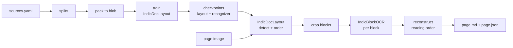

# IndicOCR — `bodhan_genai.ocr`

Document parsing for English and 22 Indian languages, printed and handwritten. A page image in; reading-ordered Markdown out, with math as LaTeX and tables as HTML or Markdown, plus per-block JSON.

Two stages with a JSON file between them.

Stage 1: **IndicDocLayout** (33M, PP-DocLayoutV3) finds and orders the blocks.  
Stage 2: **IndicBlockOCR** (0.8B, Qwen3.5) transcribes the textual blocks.



Model details, benchmarks, supported languages, and sample pages are in the model card
[bodhan-ai/indic-ocr](https://huggingface.co/bodhan-ai/indic-ocr).
New here? [docs/ocr/end-to-end.md](../../../docs/ocr/end-to-end.md) walks through the pipeline in order.

[Quickstart](#quickstart) · [Output](#output) · [Install](#install) ·
[Python API](#python-api) · [Docker](#docker) · [Configuration](#configuration) ·
[Troubleshooting](#troubleshooting)

---

## Features

- **Two models, one pipeline** — IndicDocLayout (PP-DocLayoutV3 / RT-DETR) detects and orders
  blocks; IndicBlockOCR (Qwen3.5-0.8B) transcribes each one.
- **Block-level, not page-level** — the page is cropped into blocks and each is prompted for its
  own type, so tables get the table prompt and equations get the equation one.
- **Reading-ordered Markdown plus per-block JSON** — `page.md` and `page.json` from one pass.
- **Bring your own layout** — `LayoutBackend` is a runtime-checkable Protocol, so a different
  detector is a contract rather than a fork.
- **Three recognizer backends** — vLLM (the working path), transformers (the quickstart path) and
  HTTP (served). All satisfy one interface, so served output follows the offline path.
- **Importing the package pulls in no torch, vLLM, transformers or PIL** — asserted by
  `tests/ocr/test_ocr_lazy_import.py`, which is what lets the client side install on a laptop.

---

## Evaluation

**olmOCR-Bench (English) overall: 82.9** — ahead of PaddleOCR-VL-1.6 (78.7), behind Sarvam-OCR
(84.3). Strongest on baseline text (99.2), headers/footers (98.3) and tables (89.5); weakest on
old scans (47.3) and multi-column layout (73.5).

**IndicDLP layout**: mAP@50 0.58–0.73 and reading-order Kendall tau 0.91–0.98 across seven
sources — printed textbooks, magazines, national archives and four handwriting sets. Per-source
scores ship alongside the checkpoint in `test_metrics.json`.

> **The 82.9 run does not use the shipped defaults.** It used `dedup_mode=text_only`,
> `min_px_side=256` and tables as Markdown; the shipped configuration is `dedup_mode=both` with
> tables as HTML. Re-measurement is pending. Printed and handwriting recognition numbers also
> need reevaluation.

Full tables, supported languages, limitations and citation:
**[docs/ocr/model_card.md](../../../docs/ocr/model_card.md)**.

## Quickstart

```bash
scripts/ocr/parse.sh pages/ -o out/                  # .md + .json per page
scripts/ocr/parse.sh pages/ -o out/ --save-layout    # keep the intermediate too
```

Pass a directory rather than a single page when possible. Loading the recognizer takes a few
minutes, and every block of every page then goes through one batch.

Run the stages separately to inspect or fix the layout first:

```bash
scripts/ocr/layout.sh page.png -o out/               # no recognizer loaded
# edit out/page.layout.json
python -m bodhan_genai.ocr.inference.cli ocr out/page.layout.json -o out/
```

Two more commands worth knowing:

```bash
python -m bodhan_genai.ocr.inference.cli show-contract   # prompts, block types, output fields
python examples/ocr/viz_layout.py out/page.layout.json pages/ viz/
```

---

## Serving

For pages arriving over time, or callers without a GPU, run the recognizer behind stock
`vllm serve`. Layout stays client-side, since it is a 133 MB detector that takes about a second
per page on CPU.

```bash
scripts/ocr/serve.sh                                          # GPU box
python -m bodhan_genai.ocr.serving.client pages/ -o out/      # anywhere
```

```python
from bodhan_genai.ocr.serving import OCRClient

with OCRClient("http://localhost:8000/v1") as client:
    print(client.parse("page.png").markdown)
```

The endpoint serves the recognizer alone and expects one block crop per request, so use
`OCRClient` rather than pointing a bare OpenAI client at it. Detail:
[docs/ocr/serving.md](../../../docs/ocr/serving.md).

---

## Output

```json
{"order": 2, "label": "Paragraph", "type": "Text",
 "bbox_xyxy": [77.9, 121.3, 711.8, 199.4], "conf": 0.863, "text": "Thus we see that …"}
```

`label` is the raw 37-class layout taxonomy; `type` is the coarse category that picks the prompt.
`order` is a gap-free 0-based reading-order rank.

Figures, charts, advertisements, and running headers are kept in the JSON but are not sent to the recognizer. Their text is "". Page numbers and folio text are
transcribed.

Tables come back as HTML by default, since `colspan` and `rowspan` have no Markdown equivalent.
Pass `--table-format markdown` for flat tables.

---

## Install

```bash
./install.sh --extras all-ocr     # or plain ./install.sh for every modality
source .venv/bin/activate
```

IndicOCR shares the one environment with the other three. The recognizer's **`vllm >= 0.26`
floor is what sets the shared vLLM version** for the whole repo.

Extras: `[ocr-infer]` and `[ocr-serve]`, aggregated as `[all-ocr]`. `[ocr-serve]` is the client
side and needs no vLLM, so it installs without a GPU.

Full install order and flags: **[the repository README](../../../README.md#install)**. If an
install went wrong: [docs/troubleshooting.md](../../../docs/troubleshooting.md).

---

## Python API

```python
from bodhan_genai.ocr import IndicOCR

with IndicOCR() as parser:
    print(parser.parse("page.png").markdown)
```

Stage by stage:

```python
from bodhan_genai.ocr import IndicDocLayout, IndicBlockOCR

layout = IndicDocLayout().detect("page.png")
result = IndicBlockOCR().run("page.png", layout)
```

`run()` takes a `PageResult`, a dict, or a path to a layout JSON file, so a layout from another
detector works as well as ours. `JsonLayoutBackend` replays one with no torch installed.

Also exported: `Block`, `PageResult`, `TableFormat`, the `LayoutBackend` and `RecognizerBackend`
protocols, `HfRecognizer` (a transformers-only backend, good for trying a page and too slow for a
corpus), and the four config dataclasses. Full reference:
[docs/reference/ocr.md](../../../docs/reference/ocr.md).

Construct IndicOCR before anything else touches CUDA. It starts the recognizer first so vLLM can initialise the device.

---

## Docker

The image carries its own CUDA, torch and vLLM, so nothing needs installing but Docker.

```bash
scripts/ocr/parse_docker.sh --build pages/ out/
scripts/ocr/parse_docker.sh pages/ out/ --save-layout
```

| you want | set |
| --- | --- |
| a different subcommand | `SUBCOMMAND=layout` |
| local weights instead of a Hub pull | `LAYOUT_CKPT=… RECOGNIZER_CKPT=…` |
| the download to survive `--rm` | `HF_CACHE_DIR=~/.cache/huggingface` |
| kernels not to recompile each run | `FLASHINFER_DIR=~/.cache/flashinfer` |
| specific devices | `GPUS=0,1` |

It runs a batch and exits, so there is no server and no port.

---

## Training and evaluation

Only the **layout** model is trained here. IndicBlockOCR ships as a released checkpoint and this
repo carries no recipe for it.

```bash
scripts/ocr/splits.sh                    # manifests from configs/ocr/data/sources.yaml
scripts/ocr/pack.sh                      # pack pages into the blob cache
scripts/ocr/train.sh --max-steps 20      # smoke-test the recipe first
GPUS=0,1 scripts/ocr/train.sh            # the real run
scripts/ocr/eval.sh --ckpt runs/layout/final
```

Detection and reading order are learned jointly: the base RT-DETR loss plus a
locality-weighted GCE on the pairwise precedence matrix, over the queries the Hungarian matcher
assigned to real boxes. Backbone, decoder and **order head** are warm-started from
PP-DocLayoutV3; only the class heads are re-initialized.

| you want | read |
| --- | --- |
| the corpus layout and annotation schema | [`configs/ocr/data/sources.yaml`](../../../configs/ocr/data/sources.yaml) |
| why the backbone LR and grad clipping are what they are | [docs/ocr/training.md](../../../docs/ocr/training.md) |
| what the metrics mean | [docs/ocr/training.md#evaluation](../../../docs/ocr/training.md#evaluation) |

Two things worth knowing before reading a number:

- **`tau_model_hard`, not `tau_model`.** The raster baseline is very strong on single-column
  pages, so a model that learned nothing about ordering still scores well overall.
- **The published olmOCR 82.9 used non-default settings** — `dedup_mode="text_only"` and
  Markdown tables. `python -m bodhan_genai.ocr.eval.olmocr` defaults to those and records them
  beside the predictions.

---

## Configuration

Four frozen dataclasses, settable per call or from YAML via `--config`. An unknown key in the YAML
raises rather than being ignored.

| dataclass | governs |
| --- | --- |
| `LayoutConfig` | detection threshold, input size, device |
| `CropConfig` | how block crops are sized before the recognizer sees them |
| `DedupConfig` | duplicate boxes, and equations nested inside paragraphs |
| `RecognizerConfig` | decoding, batch size, table format |

Field by field: [docs/ocr/configs.md](../../../docs/ocr/configs.md).

---

## Troubleshooting

Environment problems — CUDA mismatch, the pip resolver, 401s on private
repos — are shared across every modality and live in
**[docs/troubleshooting.md](../../../docs/troubleshooting.md)**. What follows is specific to
IndicOCR.

- **`cannot import name 'PPDocLayoutV3ForObjectDetection'`** — `transformers < 5.7`. Rebuild the
  environment.
- **`Engine core initialization failed`** — usually `ninja` is off PATH, or
  `$HOME/.cache/flashinfer` is not writable. The package works around both and warns; point
  `FLASHINFER_WORKSPACE_BASE` at persistent storage to keep the compiled kernels.
- **`Could not find nvcc` from `flashinfer/gdn_prefill.py`** — a **stale environment**. Qwen3.5's
  gated delta-net attention needs a GDN prefill kernel that older flashinfer JIT-compiles at
  first use; the pinned `flashinfer-python 0.6.14` that ships with `vllm 0.26.0` has it
  prebuilt, verified on an H100 whose node has the CUDA runtime but no compiler.
  `VLLM_USE_FLASHINFER_SAMPLER=0` covers a different path and will not help. Rebuild rather than
  hunting for `nvcc`: `rm -rf .venv && ./install.sh`.
- **Markdown is nearly empty but the JSON has blocks** — check the labels. Figures, charts and
  running headers are not sent to the recognizer.
- **A single page takes minutes** — that is engine startup. Pass a directory.

Install-time resolver errors are covered in
[docs/ocr/end-to-end.md](../../../docs/ocr/end-to-end.md#install).

More: [end-to-end](../../../docs/ocr/end-to-end.md) ·
[contract](../../../docs/ocr/contract.md) ·
[configs](../../../docs/ocr/configs.md) ·
[model card](../../../docs/ocr/model_card.md)
