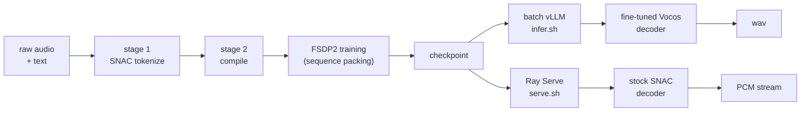

# IndicSpeak — `bodhan_genai.tts`

Orpheus-style LLM text-to-speech: a **Llama-3.2-3B** causal-LM backbone that emits discrete
[SNAC 24 kHz](https://github.com/hubertsiuzdak/snac) codec tokens. Training and inference are
**token-in, token-out** — all audio encode/decode happens in the offline data pipeline or in the
serving layer, never inside the training loop.

> Repo-level overview: [../../../README.md](../../../README.md)



## Contents

[Features](#features) · [Evaluation](#evaluation) · [Install](#install) · [Tokenizer prerequisite](#tokenizer-prerequisite--snac-token-layout) ·
[Python API](#python-api) · [Quickstart](#quickstart) · [Docker](#serve-with-docker) ·
[Configs](#configuration) · [Troubleshooting](#troubleshooting)

---

## Features

- **Public engine API** — `IndicTTSEngine` (load-once offline synthesis, vLLM or HF backend) and
  `IndicStreamingTTSEngine` (async PCM streaming, the same core the production server runs on),
  both importable from `bodhan_genai.tts`. Both default to the `bodhan-ai/indic-speak` checkpoint
  (public Hub repo).
- **Fine-tuned Vocos decoder by default (offline)** — offline decode replaces SNAC's decoder with
  a Vocos decoder trained against `snac_24khz` (weights from `bodhan-ai/indic-speak`,
  `vocos/best.pt`); SNAC's quantizer and encoder are untouched. `vocos=False` (or `--vocos false`)
  restores stock SNAC; a path loads a local `.pt`. Streaming (and therefore the server) still
  decodes with stock SNAC — see [docs/tts/inference.md](../../../docs/tts/inference.md).
- **Ray GPU SNAC tokenization** — stage 1 encodes audio from JSONL manifests or HF Hub datasets
  with GPU Ray actors, writing resumable sharded Parquet.
- **Sequence-packing FSDP2 trainer** — First-Fit-Decreasing packing into static `[1, max_seq_len]`
  batches, launched single-node via `accelerate` (`scripts/tts/train.sh`); auto-resume,
  `torch.compile`, FlashAttention-2 with `position_ids`-reset cross-sequence isolation.
- **LoRA fine-tuning** — adapter-only training (`scripts/tts/train_lora.sh`) with compact
  adapter-only checkpoints and `torch.compile` hard-disabled to avoid recompile storms.
- **Two-phase vLLM batch inference** — generate audio tokens for a whole manifest with vLLM
  workers, then batch-decode SNAC to WAVs (`scripts/tts/infer.sh`).
- **Ray Serve server, three endpoints on one engine** — one replica = one GPU = vLLM AsyncLLM +
  in-process compiled SNAC decoder + micro-batcher (`scripts/tts/serve.sh`): `WS /tts` (live
  int16-PCM streaming), `WS /tts/chunked` (long-form chunked streaming), `POST /tts/offline`
  (complete `audio/wav` response).
- **Multi-turn conversation templates** — `<|speaker>S1<speaker|>` conversation sequences built by
  `bodhan_genai.tts.templates`, rendered by all inference paths, including streaming.
- **Release qualification** — deterministic deployment gates before promoting a build. See
  [docs/tts/release.md](../../../docs/tts/release.md).

## Evaluation

Content fidelity is scored by an LLM judge over ASR transcripts of generated audio: each
reading is recognised with **IndicTranscribe**, and the transcript is graded against the source
text by **Gemma-4-31B-IT** using a content-fidelity rubric (0–5). This measures whether the
words came out right — not naturalness or speaker similarity.

**Corpus:** 30,000 readings — 15,000 code-mixed sentences, each spoken by 2 voices
(283 hours of audio).

| | |
|---|---|
| Judge score | **4.901 / 5** |
| Scored 5 (top band) | **93.0%** |
| Scored ≤2 | 0.7% |
| Native casting | 4.941 — 95.7% top band |
| Cross-lingual casting | 4.899 — 92.9% top band |

### By language

| Language | Code | Judge (0–5) | Scored 5 | Scored ≤2 | Readings |
|---|---|---|---|---|---|
| Hindi | `hi` | 4.911 | 93.6% | 0.47% | 3,000 |
| Kannada | `kn` | 4.905 | 93.6% | 0.70% | 3,000 |
| Malayalam | `ml` | 4.906 | 93.5% | 0.77% | 3,000 |
| Tamil | `ta` | 4.904 | 93.5% | 0.77% | 3,000 |
| Gujarati | `gu` | 4.905 | 93.4% | 0.70% | 3,000 |
| Odia | `or` | 4.902 | 93.4% | 0.97% | 3,000 |
| Bengali | `bn` | 4.893 | 92.7% | 0.90% | 3,000 |
| Urdu | `ur` | 4.904 | 92.7% | 0.53% | 3,000 |
| Telugu | `te` | 4.893 | 92.1% | 0.53% | 3,000 |
| Marathi | `mr` | 4.890 | 92.0% | 0.70% | 3,000 |

The ten benchmarked languages span 92.0%–93.6% in
top-band rate — a spread of 1.6 points against a
measurement uncertainty of roughly ±0.9, so they are not meaningfully separated.

### By voice

| Strongest (cross-lingual) | Judge |
|---|---|
| `Anagha` | 4.962 |
| `Sourav` | 4.958 |
| `Kavya` | 4.955 |
| `Amit` | 4.955 |
| `Bharati` | 4.954 |

| Weakest | Judge |
|---|---|
| `Sansuma` | 4.532 |
| `Gwrbw` | 4.736 |
| `Madhukar` | 4.757 |

### Caveats

- **Coverage is 10 of 22 languages.** The other twelve have voices and playable audio but no
  scored evidence yet.
- **Cross-lingual casting costs about 3 points** of top-band rate (95.7% native vs
  92.9% cross-lingual) — using a voice outside its own language is measurably worse.
- **Content fidelity only.** Naturalness, speaker similarity and prosody are not measured here.
- **Judge and recognizer are themselves models.** IndicTranscribe errors and Gemma-4 grading noise
  both land in these numbers; treat small differences as noise.
- Preference studies against competing systems are in progress.

## Install

```bash
./install.sh --extras all-tts     # TTS alone; plain ./install.sh covers every modality
source .venv/bin/activate
```

Extras stay modality-scoped: `[tts-data]`, `[tts-train]`, `[tts-infer]`, `[tts-serve]`,
aggregated as `[all-tts]`.

**flash-attn is needed only to _train_** (`attn_implementation="flash_attention_2"`, required by
the sequence-packing collator). Data, inference and serving run without it — vLLM ships its own
attention kernels — so `./install.sh --no-flash-attn` is correct on a serving box and skips a long
source build. PyPI ships [flash-attn](https://github.com/Dao-AILab/flash-attention) as an sdist
with no wheel, which is why it compiles rather than downloads.

The install order is load-bearing (**vLLM first** — it pulls its own matched torch; pre-pinning
torch half-installs it). That, the flags, and the offline/air-gapped paths live in one place:
**[the repository README](../../../README.md#install)**. If an install went wrong, go to
[docs/troubleshooting.md](../../../docs/troubleshooting.md).

## Tokenizer prerequisite

This repo **does not create tokenizers**. Every stage requires a Llama-3 tokenizer already
extended with the frozen audio-token layout — `len(tokenizer) == 156942`. The canopylabs Orpheus
checkpoints ship one; point `model.tokenizer_path` at a local copy of it.

The layout is **frozen**: structural token ids, the `<|snac_0|>` audio base at 128266, the 7-token
SNAC frame interleave and the dedup rule. Runtime code always resolves the base id via
`tokenizer.convert_tokens_to_ids("<|snac_0|>")`, never a hardcoded literal.

Full contract, id table and interleave formula: **[docs/tts/token_layout.md](../../../docs/tts/token_layout.md)**.
Read it before touching stage 2 — a layout mismatch produces audio-shaped noise, not an error.

## Python API

`from bodhan_genai.tts import IndicTTSEngine, IndicStreamingTTSEngine` — both are lazy exports,
so importing `bodhan_genai.tts` stays free of torch/vLLM until an engine is actually built.

Offline synthesis (vLLM backend by default):

```python
from bodhan_genai.tts import IndicTTSEngine

engine = IndicTTSEngine()  # bodhan-ai/indic-speak + fine-tuned Vocos decoder
result = engine.synthesize("Hello world", speaker="S1", style="")
result.save("hello.wav")
```

The zero-arg default pulls the public `bodhan-ai/indic-speak` repo; pass a local path to skip
the Hub entirely. `style=` reaches the
`<|style>` slot of the prompt template; `vocos=False` decodes with stock SNAC instead of the
fine-tuned Vocos decoder (a path loads a local `vocos` `.pt`).

HF `generate()` backend (adapters / debugging):

```python
engine = IndicTTSEngine("/path/to/checkpoint", backend="hf", adapter_dir="/path/to/lora")
```

Streaming (async; yields raw int16 PCM frames at 24 kHz):

```python
from bodhan_genai.tts import IndicStreamingTTSEngine

engine = IndicStreamingTTSEngine("/path/to/checkpoint")
async for pcm in engine.stream("Hello world", speaker="S1"):
    play_or_send(pcm)  # raw int16 LE PCM @ 24 kHz
await engine.shutdown()
```

For plain scripts/notebooks, `engine.stream_sync(...)` drives the same stream on a private event
loop and yields frames synchronously.

### Two synthesis modes

Besides single-utterance synthesis, both engines take a whole conversation as a chat-style message
list and render it through the conversation template (`<|speaker>NAME<speaker|>` tags inline, one
continuous multi-speaker audio sample):

```python
messages = [
    {"speaker": "S1", "text": "Hey, did you finish the report?"},
    {"speaker": "S2", "text": "Almost — sending it over tonight."},
]
engine.synthesize_conversation(messages).save("dialogue.wav")  # IndicTTSEngine

async for pcm in streaming_engine.stream_conversation(messages):  # streaming
    ...  # (or stream_conversation_sync(...) in scripts)
```

### Long-form / chunked synthesis

Single-shot generation caps at ~25 s of audio (`max_new_tokens` 2048). `ChunkedIndicStreamingTTS`
wraps either engine:

```python
from bodhan_genai.tts import IndicTTSEngine, IndicStreamingTTSEngine, ChunkedIndicStreamingTTS

long_form = ChunkedIndicStreamingTTS(IndicTTSEngine("/path/to/checkpoint"))
long_form.synthesize_long(very_long_text, speaker="S1").save("longform.wav")

streamer = ChunkedIndicStreamingTTS(IndicStreamingTTSEngine("/path/to/checkpoint"))
async for pcm in streamer.stream_long(very_long_text, speaker="S1"):
    ...  # (or stream_long_sync in scripts)
```

<details>
<summary>How chunking and loudness actually work</summary>

It segments long text into sentences with a rule-based scanner (`split_sentences`, also exported).
Maximal runs of the sentence terminators `. ! ? … । ॥ 。 ！ ？` end a sentence — Devanagari danda and
CJK marks split even when glued to the next word, Latin `./!/?` need following whitespace — while
ellipses (`…`, `...`, `. . .`) never split, and decimals ("3.14"), abbreviations ("Dr.", "e.g.",
"डॉ."), initials ("J. K. Rowling") and quote attribution ('"Stop!" she yelled.') are guarded.

Clause marks (`, ; :` and fullwidth `，；：、`) never end a sentence: they are only the first rung of
the oversize-sentence fallback ladder (clause mark → newline → whitespace → hard cut) used when a
single sentence exceeds `max_chars`. Packing is greedy — `max_chars` is a strict bound on every
chunk, `min_chars` is best-effort merging only.

Chunks are synthesized independently and delivered as ONE consistent-volume utterance — per-chunk
silence-trim + LUFS normalization (−23, pyloudnorm with RMS fallback), 250 ms gaps, and a final peak
cap at −1 dBFS. Streaming uses a hybrid: a chunk whose generation finished before its turn gets the
exact per-chunk treatment (typical for paced playback clients), and still-generating chunks stream
through a causal loudness smoother (`bodhan_genai.tts.engine.loudness`) that targets the same
silence-gated level — so both paths land at one volume. Normalization gain is clamped to ±12 dB and
near-silent chunks pass through, so a breath-only chunk is never boosted to program loudness.

For multi-turn dialogue, `plan_dialogue_chunks(messages, max_chars=..., long_turn_chars=...)` (also
exported) plans a `[{"speaker", "text"}]` message list into chunks whose SERIALIZED conversation
form — speaker tags included, lock-step with `templates.conversation.format_messages` — fits
`max_chars`. Whole turns are packed greedily; a turn longer than `long_turn_chars` (default:
`max_chars`) is exploded at sentence boundaries into consecutive same-speaker segments, and passing
`long_turn_chars > max_chars` is the keep-turns-intact escape hatch. Empty-text turns are dropped; a
blank speaker with text raises `ValueError`.

</details>

Over the server, use the dedicated endpoint `WS /tts/chunked`
(`examples/tts/streaming_client.py --mode chunked`); the per-request `{"chunked": true}` flag on
`/tts` and the `--chunked_default` server flag also work.

**Also exported:** `SamplingConfig` (defaults: temperature 0.6, top_p 0.95, top_k -1,
repetition_penalty 1.1, max_new_tokens 2048) and `TTSResult` (float32 audio @ 24 kHz, token counts,
`gen_time_s`/`decode_time_s`, `.duration_s`, `.rtf`, `.save(path)`).
`engine.synthesize_batch([...])` runs a whole list through one vLLM generate call and isolates
per-row failures in `result.error` instead of raising. Both engines are context managers
(`with` / `async with`); use one engine per process and `.close()` / `await .shutdown()` when done.

Runnable walkthroughs: [notebooks/tts/inference.ipynb](../../../notebooks/tts/inference.ipynb) ·
[notebooks/tts/training.ipynb](../../../notebooks/tts/training.ipynb)

## Quickstart

### 1. Tokenize audio (stage 1)

```bash
python -m bodhan_genai.tts.data.tokenize --config configs/tts/data/tokenize.yaml
```

SNAC-encodes audio from JSONL manifests or HF Hub datasets on GPU via Ray; writes sharded Parquet
with `token_ids` + metadata and a resume manifest (completed shards are skipped on restart).

### 2. Compile training sequences (stage 2)

```bash
python -m bodhan_genai.tts.data.compile --config configs/tts/data/compile.yaml
```

Applies the chat templates (basic TTS / conversation) to produce `input_ids` / `labels` / `length`
Parquet, sorted length-descending for packing.

### 3. Train

```bash
scripts/tts/train.sh configs/tts/train/pretrain.yaml
```

Single-node `accelerate` launch with the FSDP2 config. `NUM_GPUS=N` overrides the GPU count;
training auto-resumes from the latest checkpoint in `output_dir`; set `WANDB_MODE=offline` (or
`disabled`) to control logging.

### 4. LoRA fine-tune

```bash
scripts/tts/train_lora.sh configs/tts/train/lora.yaml
```

### 5. Batch inference

```bash
scripts/tts/infer.sh --jsonl-path eval.jsonl --output_dir out/
```

Two-phase vLLM run: generate audio token ids for every prompt, then batch-decode SNAC to WAVs.

### 6. Serve + stream

```bash
scripts/tts/serve.sh   # CHECKPOINT=/path/to/checkpoint overrides the bodhan-ai/indic-speak default
python examples/tts/streaming_client.py --text "Hello from the streaming server." --out stream.wav
```

One server exposes three endpoints: `WS /tts` (live streaming), `WS /tts/chunked` (long-form
chunked streaming), and `POST /tts/offline` (complete `audio/wav`) — the client selects with
`--mode {stream,chunked,offline}`, or plain curl for offline:

```bash
curl -s -X POST localhost:8000/tts/offline -H 'content-type: application/json' \
  -d '{"text": "Hello world", "speaker": "Amit"}' -o out.wav
```

Or one-shot offline synthesis without a server:

```bash
python examples/tts/basic_tts.py --model /path/to/checkpoint --text "Hello world" --out out.wav
```

## Serve with Docker

[docker/tts/Dockerfile.serve](../../../docker/tts/Dockerfile.serve) packages the streaming server
(CUDA 12.8 base, uv-managed Python 3.12.13, cu128 torch → vLLM/Ray → package install order, no
flash-attn — it's a training-only dep). Model weights are **not** baked in; mount them at run time.
Requires the [NVIDIA Container Toolkit](https://docs.nvidia.com/datacenter/cloud-native/container-toolkit/).

```bash
CHECKPOINT_DIR=/path/to/checkpoint \
TOKENIZER_DIR=/path/to/extended-tokenizer \
SNAC_DIR=/path/to/snac_24khz \
GPUS=0 scripts/tts/serve_docker.sh
```

Knobs (env): `PORT` (default 8000), `GPUS` (`all` or `0,1`), `NUM_REPLICAS` (default = visible
GPUs), `SHM_SIZE` (default 8g — Ray/vLLM need real `/dev/shm`), `CHECKPOINT=<hf-id>` instead of
`CHECKPOINT_DIR` to pull from the Hub (`HF_TOKEN` if gated); `--build` as the first argument forces
a rebuild. Extra flags pass through to `serving.app`.

<details>
<summary>Equivalent raw docker + smoke check</summary>

```bash
docker build -f docker/tts/Dockerfile.serve -t bodhan-tts-serve .
docker run --rm -it --gpus all --shm-size 8g -p 8000:8000 \
  -v /path/to/checkpoint:/models/checkpoint:ro \
  -v /path/to/extended-tokenizer:/models/tokenizer:ro \
  -e CHECKPOINT=/models/checkpoint -e TOKENIZER=/models/tokenizer -e HF_HUB_OFFLINE=1 \
  bodhan-tts-serve
```

```bash
curl -s localhost:8000/health
python examples/tts/streaming_client.py --url ws://localhost:8000 --mode stream --text "Hello" --out d.wav
curl -s -X POST localhost:8000/tts/offline -H 'content-type: application/json' \
  -d '{"text": "Hello"}' -o d_offline.wav
```

</details>

## Configuration

Field-by-field docs in [docs/tts/configs.md](../../../docs/tts/configs.md).

| file | purpose |
|---|---|
| `configs/tts/data/tokenize.yaml` | Stage-1 SNAC tokenization: Ray, datasets, output shards |
| `configs/tts/data/compile.yaml` | Stage-2 sequence compilation: templates, dataset splitting |
| `configs/tts/train/pretrain.yaml` | Full-FT pretraining run (packing, FSDP2, compile) |
| `configs/tts/train/sft.yaml` | Full-FT SFT run on compiled SFT data |
| `configs/tts/train/lora.yaml` | LoRA adapter run (`lora:` block, compile disabled) |
| `configs/tts/accelerate/single_node_fsdp.yaml` | Single-node accelerate + FSDP2 launcher config |
| `configs/tts/infer/offline_vllm.yaml` | Two-phase vLLM batch inference settings |

## Troubleshooting

Environment problems — CUDA mismatch, flash-attn builds, the pip resolver swapping in a CPU torch,
401s on private repos — are shared across every modality and live in
**[docs/troubleshooting.md](../../../docs/troubleshooting.md)**. What follows is specific to
IndicSpeak.

- **401/404 from the Hub on first run** — the default checkpoint and Vocos decoder live in the
  public `bodhan-ai/indic-speak` repo, so this should not happen on the defaults. If you pointed
  at a gated or private repo, export an `HF_TOKEN`; otherwise pass local paths for the model and
  `vocos` arguments. Decoder-load failures raise on purpose rather than silently falling back to
  SNAC's decoder.
- **VOCAB MISMATCH TRAP** — the extended tokenizer has `len == 156942` but canopylabs checkpoints
  have a vocab of ~156940. Training auto-resizes the embedding to match the tokenizer, so training
  is safe. At **inference**, load the checkpoint's *own* tokenizer unless you know it was trained
  against the extended tokenizer — mixing them shifts the speaker/style wrapper ids and silently
  corrupts prompts.
- **Serving hangs at startup / Ray connection errors** — export `RAY_ADDRESS=local` and
  `VLLM_ENABLE_V1_MULTIPROCESSING=0` (`scripts/tts/serve.sh` sets both). vLLM AsyncLLM and the
  in-process SNAC decoder must share one process and CUDA context.
- **First training step takes 10–20 min** — that is `torch.compile` warming Inductor, not a hang.
  For smoke runs set `compile: false` in the train config. `scripts/tts/train.sh` raises the NCCL
  heartbeat timeout to an hour for exactly this reason.

## Reference docs

[token_layout](../../../docs/tts/token_layout.md) ·
[data_pipeline](../../../docs/tts/data_pipeline.md) ·
[configs](../../../docs/tts/configs.md) ·
[serving](../../../docs/tts/serving.md) ·
[release](../../../docs/tts/release.md)
